

[中文](./README.md) · **English**

# lyjwpage

**A personal homepage driven by real devices and everyday activity.**

[Visit](https://lyjw.me) · [Mirror for mainland China](https://lyjw131.com) · [Interactive architecture diagram](https://lyjw131.github.io/lyjwpage/)

How-it-works explainer: [中文](https://lyjw131.com/explainer?lang=zh) · [English](https://lyjw.me/explainer?lang=en)

What I'm listening to, watching and playing, which apps are in use, how my devices are doing: this homepage gathers state scattered across a Mac, an iPhone, a NAS and cloud services onto a single page.

It is both my personal homepage and a personal telemetry system that keeps evolving. This repository holds the site's source code, plus the architecture and implementation from device collection and state aggregation to page rendering.

## What's on the page

| Module | What it shows |
| --- | --- |
| **This Mac and chargers** | The Mac's front app (a few everyday tools get brand marks and animations) and the window title, when it passes the privacy check; port status, voltage, current and power of Anker chargers and power banks. |
| **Watching** | What's playing on Emby and recently watched, with progress, episode info, and video and audio specs. |
| **Music** | Apple Music and HomePod playback, recently played, word-by-word lyrics and animated covers; visitors can use the web player and "Listen together" with their own Apple Music account and subscription. |
| **Activity** | Apple Watch Move, Exercise and Stand rings from the iPhone's HealthKit data, plus duration, energy and heart rate of the 10 most recent workouts. |
| **Server** | Uptime, CPU, memory and network throughput of the exit node, plus traffic accumulated over the billing cycle. |
| **AI Coding** | Token usage of coding tools, API-equivalent cost estimates, a yearly heatmap and account limit windows. |
| **Games** | PlayStation online status, game history and trophy progress; expand a game card for per-trophy details. |
| **Pulse** | 24-hour activity lanes for six domains: coding, listening, watching, playing, charging and physical activity. Hover any segment to see what was playing, being watched or played, and that window's score. |
| **The site itself** | Site version, GitHub repository stats and recent commits (with signature status); 30-day uptime rows for the site and the API, rolling medians of PageSpeed lab scores and a real-visitor performance score; request stats and 12-hour error counts for Vercel and Cloudflare Workers, plus push counts, round-trip latency and live versions of the two resident reporters on the exit node. |

The interface is built on grayscale, hairline borders and cards, with tabular figures keeping live metrics steady. Color and motion mostly serve media, state changes and interaction feedback.

## Screenshots

The homepage is dynamic: cards like now watching, charging or playing only appear while that thing is happening. The images below light up all of those states at once using sample data on a local build, following the system light or dark theme; the animated ones were recorded from the live site.

<picture>
  <source media="(prefers-color-scheme: dark)" srcset="docs/screenshots/overview-dark.webp">
  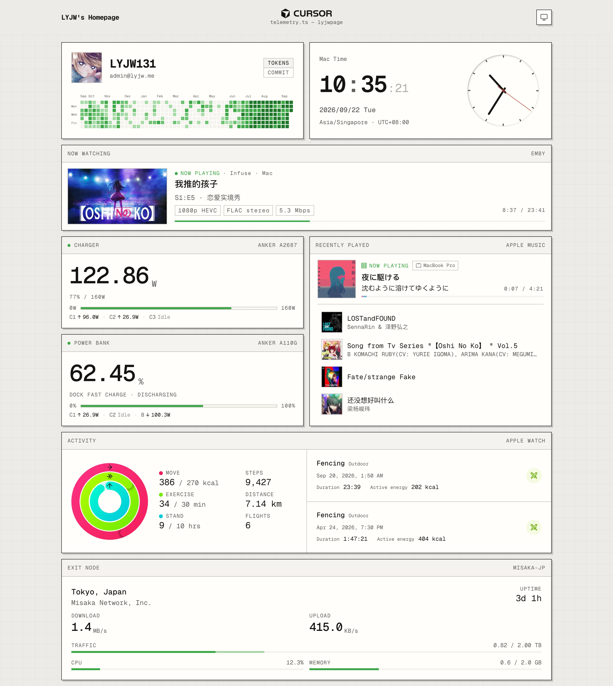
</picture>

**Front app in the header**: the middle of the header shows the Mac's current front app, with the icon and name reported by the Mac reporter. A few everyday tools get brand marks instead. Claude Code is the pixel mascot's fetch animation from [mascot-fetch-loop](https://github.com/LYJW131/mascot-fetch-loop): 19 poses rebuilt frame by frame from a screen recording, with the sprite data inlined and played by the site itself ([live preview](https://lyjw131.github.io/mascot-fetch-loop/)). Ghostty is the ASCII ghost from its [homepage](https://ghostty.org/). `scripts/ghostty-frames.mjs` pulls the 235 frames of 100×41 characters out of the homepage payload, merges every two columns into one cell, buckets glyph ink into three body levels and three halo levels, keeps every third frame, and packs the result into 79 frames on a coarse 39×39 grid (`src/lib/ghostty-frames.json`, 57 KB). The site loops it as SVG paths at 93 ms per frame; the body follows the page's text color while the halo keeps the homepage blue. Cursor and Antigravity use wordmarks from the [LobeHub icon set](https://github.com/lobehub/lobe-icons).

<picture>
  <source media="(prefers-color-scheme: dark)" srcset="docs/screenshots/desktop-marks-dark.gif">
  
</picture>

The faint line under the app name is the current window title; the Cursor and Antigravity clips show it appearing, changing and disappearing. Only titles that pass the privacy check show up at all; see below.

**Now watching on Emby**: poster, episode, progress, plus video, audio and bitrate specs.

<picture>
  <source media="(prefers-color-scheme: dark)" srcset="docs/screenshots/now-watching-dark.webp">
  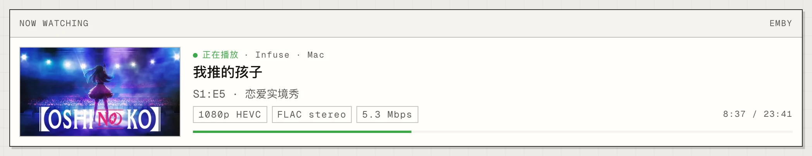
</picture>

**Chargers**: per-port power, device and protocol of the Anker charger, plus a total power curve; charge level, charging and discharging, temperature and health of the power bank.

<table>
  <tr>
    <td width="50%">
      <picture>
        <source media="(prefers-color-scheme: dark)" srcset="docs/screenshots/charger-dark.gif">
        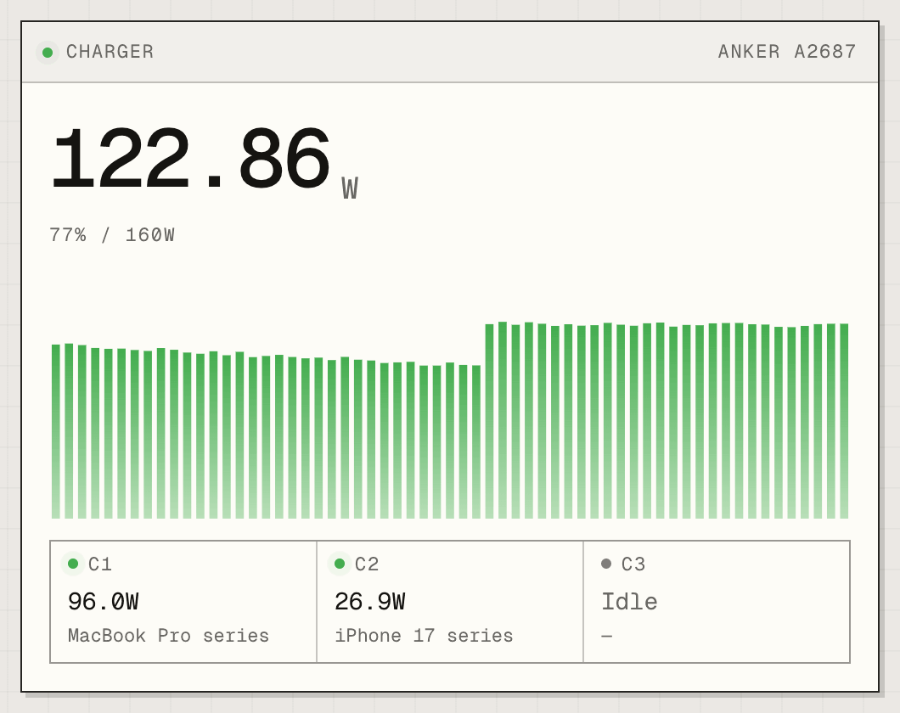
      </picture>
    </td>
    <td width="50%">
      <picture>
        <source media="(prefers-color-scheme: dark)" srcset="docs/screenshots/powerbank-dark.webp">
        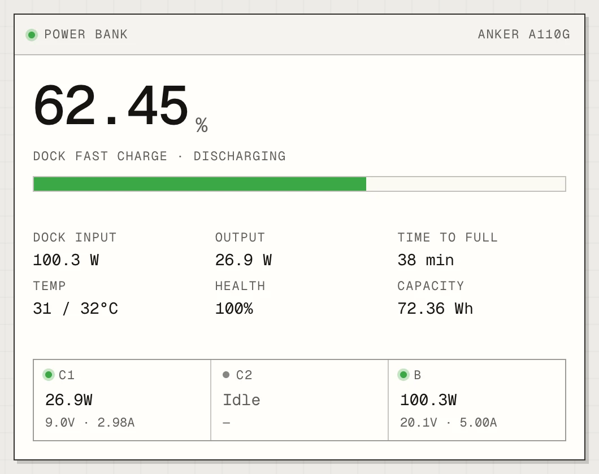
      </picture>
    </td>
  </tr>
</table>

**Now playing on Apple Music**: cover, source device, progress and synced lyrics highlighted word by word, with recently played below.

<picture>
  <source media="(prefers-color-scheme: dark)" srcset="docs/screenshots/now-listening-dark.gif">
  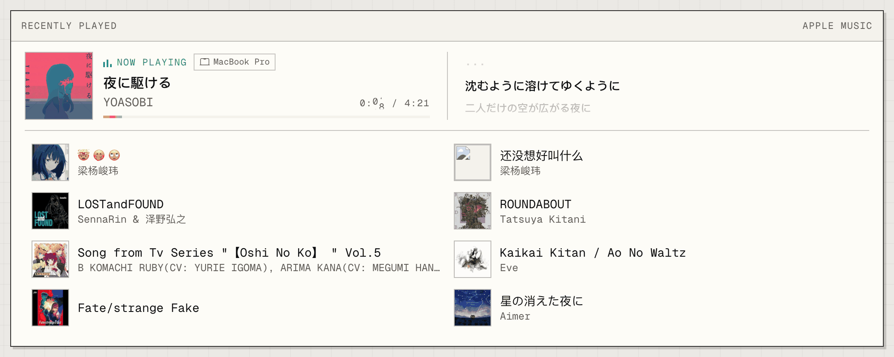
</picture>

**Activity and workouts**: Apple Watch Move, Exercise and Stand rings with steps, distance and flights climbed; recent workouts on the right, two per page, paged sideways.

<picture>
  <source media="(prefers-color-scheme: dark)" srcset="docs/screenshots/activity-dark.gif">
  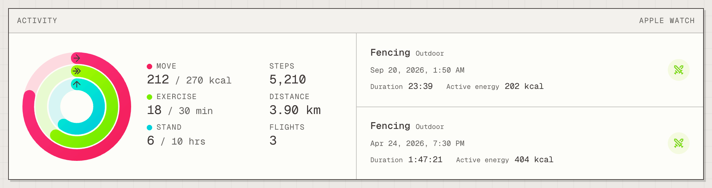
</picture>

**Exit node**: location and carrier, up and down rates, traffic used this billing cycle, plus CPU and memory.

<picture>
  <source media="(prefers-color-scheme: dark)" srcset="docs/screenshots/server-dark.gif">
  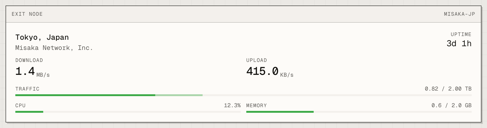
</picture>

**AI Coding**: token usage, cost estimates, today's usage and account limit windows for each coding tool.

<picture>
  <source media="(prefers-color-scheme: dark)" srcset="docs/screenshots/vibecoding-dark.gif">
  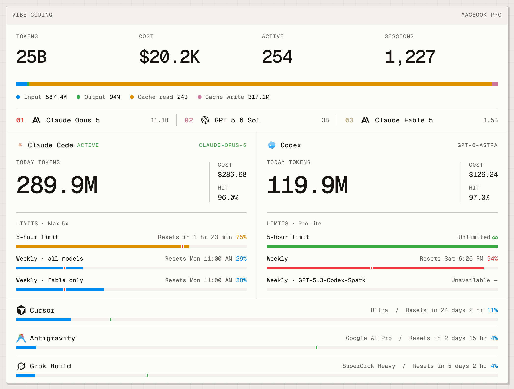
</picture>

**PlayStation**: online status, the game being played, trophy stats and recent unlocks; expand a game card for trophy groups and each trophy.

<picture>
  <source media="(prefers-color-scheme: dark)" srcset="docs/screenshots/playstation-trophies-dark.webp">
  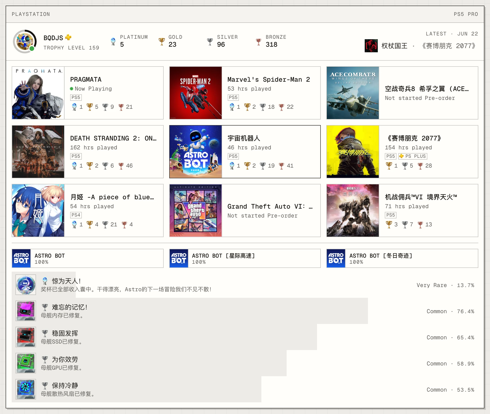
</picture>

**Pulse**: 24-hour activity lanes for six domains. Watching and playing plot measured playback and game state, charging plots measured watts; coding, listening and physical activity plot Jev's five-minute scores. When music plays on an iPhone or similar device, the Mac can't see it, so the listening score also draws on the recently played list. Physical activity comes from the iPhone querying closed five-minute HealthKit buckets, so it doesn't depend on a background upload arriving on time. Missing buckets stay unknown, and activity estimates never extend to the present moment. Besides the bucket levels, physical activity also considers the names of completed workouts and the active seconds falling in each five-minute window. Each lane summarizes intensity, trend and confidence on the right, and history is archived to D1 every minute. Hover, click or arrow-key onto a segment to see its time range, the track playing then (likewise for shows being watched and games being played), and that window's intensity, continuity and confidence; spans where playback stopped don't carry over the previous track's name.

<picture>
  <source media="(prefers-color-scheme: dark)" srcset="docs/screenshots/pulse-detail-dark.webp">
  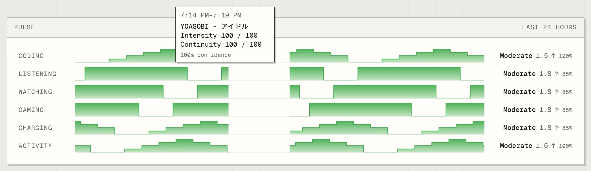
</picture>

**The site itself (LYJWPAGE)**: repository stats, contributors and recent commits. Below that, two status-page-style uptime rows: `lyjw.me` follows Sentry's per-minute check, and `API` follows the heartbeat of the api Worker's minute cron, each with 30 daily cells and an availability figure. Further down are the PageSpeed lab score and the real-visitor Users score, 12-hour requests, CPU and error counts per service, and push counts, round-trip latency and live versions of the two resident reporters on the exit node.

<picture>
  <source media="(prefers-color-scheme: dark)" srcset="docs/screenshots/site-status-dark.webp">
  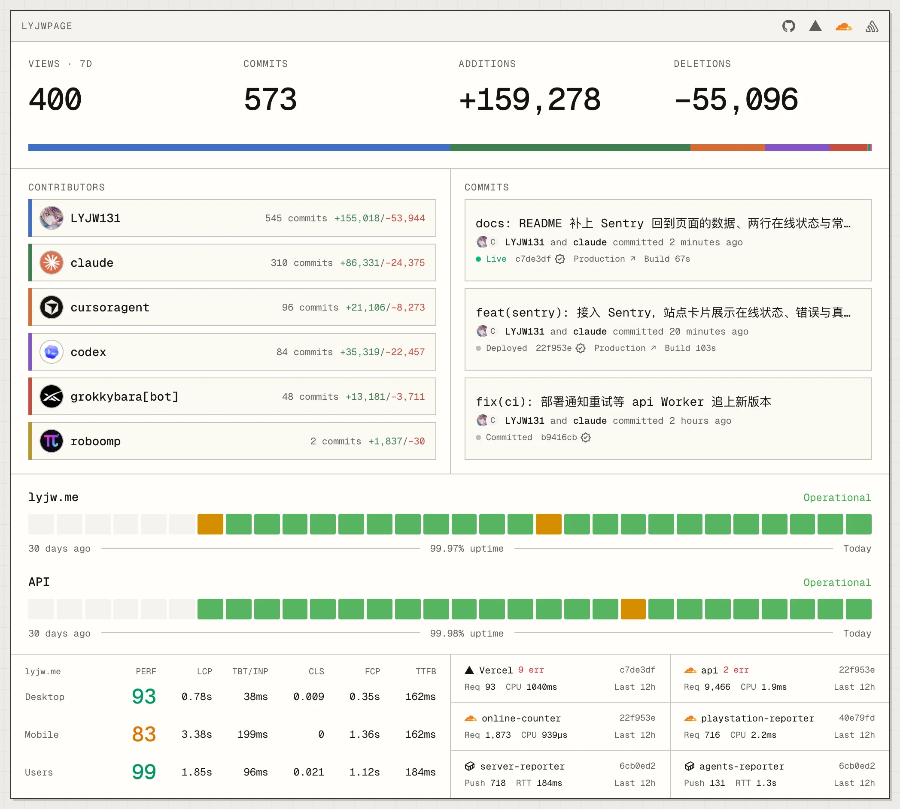
</picture>

## Architecture

The system has three parts: **collectors adapt to each source, Cloudflare manages state in one place, and Next.js renders the page.**

<picture>
  <source media="(prefers-color-scheme: dark)" srcset="docs/architecture-dark.png">
  
</picture>

[Open the interactive architecture diagram](https://lyjw131.github.io/lyjwpage/)

**Collectors** run where the data is produced. The Mac collects local apps, music, BLE devices and coding usage; the iPhone reads activity; the NAS relays Emby playback; Linux reporters provide server metrics and agent limits. Home Assistant brings in HomePod and other home devices, and a separate Worker syncs PlayStation data on a schedule.

**The state hub** is Cloudflare Workers: it receives reports, merges data from external services, and serves the public status API and live push. Durable Objects SQLite holds snapshots and history and is the single source of truth. Public read models for a few slow endpoints are published to KV; reads try KV first and fall back to the DO when an entry is missing or too old. R2 stores images such as posters, D1 archives Pulse's per-minute history, and a separate Worker keeps the online visitor count.

**The frontend** runs on Vercel. Next.js reads the Worker's aggregated snapshot when building the homepage; once mounted, the browser connects straight to the Worker for the latest state, and Vercel no longer relays status requests. The mainland China entry point accelerates pages and static assets through Alibaba Cloud ESA.

## Key design choices

### First-paint snapshots and live updates are handled separately

The homepage fetches every module's snapshot in one aggregated read and caches it with Next.js `use cache`, so the first paint doesn't depend on the browser requesting each card.

After load, the browser updates live data by talking to the Worker directly. The homepage cache is invalidated by tag and rebuilt in the background only when the layout changes (a card appears or disappears, changes form or changes row count; criteria in `src/lib/home-layout.ts`). Content changes such as readings, titles and progress are left to a scheduled rebuild every 10 minutes, and bare heartbeats never trigger one.

So the cached page takes care of the first paint and the client catches up to the current state; the full HTML doesn't need refreshing on every device change.

### Push, polling and local extrapolation each have their job

Events like changing songs, switching front apps and plugging devices in are pushed over WebSocket. Most events carry the new data and write it into the SWR cache, so visitors don't each fire the same query after a notification.

Continuous metrics such as power curves and cumulative usage are polled as needed, while playback progress is extrapolated in the browser from time anchors. Polling also backs up live push, and a freshness check on the client stops an older polling result from overwriting newer state it already received.

### Sources share state while keeping failure boundaries

Device protocols and third-party APIs are adapted by their own collectors; the page consumes one public state model and never depends directly on services inside the home network.

State read-modify-writes are merged serially and persisted inside the Durable Object. When one source is unavailable, the shared status response degrades just that card instead of making the whole page wait for every device.

Writing reports requires authentication, public queries return only explicit display models, and server credentials are kept apart from public state.

### Window titles pass a check before they are reported

The window title is the only piece of window content on the page, and the only one that can't be covered by exhaustive rules: there are only so many app names, but a title is whatever file, web page or chat is open right now. So before it leaves the Mac it goes through a privacy check. [TypeSafe](https://www.typesafe.ai/)'s Jev takes part in deciding whether it can be public, and cases it isn't sure about are left for me to decide on the Mac; only titles that are let through make it into the report envelope. The site side doesn't judge anything; it only looks at whether the envelope carries a title.

### Cost follows activity and visitors

Some collectors adjust how often they report based on device activity and visitor connections, and browser tabs pause status polling while hidden. WebSockets use the Hibernation API, so connections stay open without keeping an instance running when there are no events.

Live push connections and the visible-visitor count are tracked separately: the former is about keeping state in sync, the latter about how many people are looking at the page right now.

### Images are content-addressed, and the visitor's domain decides which edge delivers them

Posters and app icons are compressed once by the reporter and uploaded straight to R2 as `<sha256>.<ext>`; state only stores the object key. The Worker and the site turn the object key into the same-origin path `/img/<object key>`, so no delivery domain appears in pages, the status API or pushes.

On `lyjw.me`, a rewrite in `next.config.ts` proxies `/img/*` to R2's public origin (`R2_PUBLIC_BASE_URL`, configured only on Vercel): Vercel's edge forwards and caches by R2's `immutable` header without going through a Function. On `lyjw131.com`, ESA caches the same path by static suffix and goes back to the origin, so visitors in mainland China no longer connect to Cloudflare directly. Objects carry a one-year immutable cache and the address is the content fingerprint, so neither edge ever needs purging.

### Errors and performance go to Sentry

The site (browser and Vercel functions) and the `api` Worker (requests, the minute cron and both Durable Objects) each report to their own Sentry project. The browser reports through the same-origin `/relay`, so visitors with ad blockers or no route to sentry.io still get through; Session Replay is a separate chunk loaded only after the page goes idle, and keeps only the part with the error. The minute cron has heartbeat monitoring, and `lyjw.me` gets an uptime check every minute. Sampling is set to fit the free tier; entry points are [`src/lib/sentry.ts`](./src/lib/sentry.ts) and [`workers/api/src/sentry.ts`](./workers/api/src/sentry.ts). Local development doesn't report by default; to try it, set `NEXT_PUBLIC_SENTRY_DEV=true` in `.env.local`.

Data in Sentry also comes back to the page: using a read-only token, the `api` Worker fetches both projects' error counts, real-visitor Web Vitals, uptime checks and cron heartbeats, only when someone reads them, caches them for 15 minutes, and serves them to the site card (`/api/status/sentry`). Uptime has two rows: the `lyjw.me` row checks a static route on Vercel, which only shows the frontend is still serving pages; the `API` row follows the cron heartbeat, where every run passes through the Worker, the Durable Object and KV, covering the backend side. When investigating production errors, agents first gather evidence through the Sentry MCP before reading code; the rules are in [`AGENTS.md`](./AGENTS.md).

## Tech stack

| Layer | Main technologies |
| --- | --- |
| Pages and types | Next.js 16 App Router · React 19 · TypeScript |
| Styling and interaction | Tailwind CSS 4 · Motion · Number Flow · Geist |
| Client data | SWR · WebSocket |
| State and asset storage | Cloudflare Workers · Durable Objects SQLite · KV · D1 · R2 |
| Activity scoring | TypeSafe System One (Jev) |
| Native device integration | Swift / SwiftUI · HealthKit · BLE |
| Hosting and delivery | Vercel · Alibaba Cloud ESA |
| Error and performance monitoring | Sentry |

## Where to start reading

| If you want to know | Start here |
| --- | --- |
| How the homepage assembles its modules | [`src/app/page.tsx`](./src/app/page.tsx) · [`src/components/live/`](./src/components/live/) |
| How the first paint reads and caches state | [`src/lib/home-snapshot.ts`](./src/lib/home-snapshot.ts) |
| How status views are registered on both sides | [`src/lib/status-views.ts`](./src/lib/status-views.ts) · [`src/lib/status-loaders.ts`](./src/lib/status-loaders.ts) |
| How push and polling update the same client state | [`src/hooks/use-live-events.ts`](./src/hooks/use-live-events.ts) · [`src/hooks/use-status.ts`](./src/hooks/use-status.ts) · [`src/lib/status-reads.ts`](./src/lib/status-reads.ts) |
| How the web player and lyrics work | [`src/hooks/use-web-player.ts`](./src/hooks/use-web-player.ts) · [`src/hooks/use-lyrics.ts`](./src/hooks/use-lyrics.ts) |
| How ingest, state storage and the public API are organized | [`workers/api/`](./workers/api/) |
| How each device and service is connected | [`reporters/`](./reporters/) · [`workers/playstation-reporter/`](./workers/playstation-reporter/) |
| How online visitors are counted | [`workers/online-counter/`](./workers/online-counter/) · [`src/hooks/use-online-count.ts`](./src/hooks/use-online-count.ts) |

The Mac collector [MacTelemetryHub](https://github.com/LYJW131/MacTelemetryHub) is maintained separately and included as a Git submodule at `reporters/mac-telemetry-hub/`.

## Further reading

The following documents are in Chinese.

[Telemetry and live state subsystems](./docs/telemetry-subsystems.md) covers how each data source is connected, its protocol and its implementation.

[Worker data backend and first-paint cache](./docs/state-storage.md) explains how state persistence, public data boundaries, cache invalidation and page updates relate; publishing and fallback rules for KV read models are in [KV public read models](./docs/kv-read-model.md).

The iPhone collector [iPhone Telemetry Hub](./reporters/iphone-telemetry-hub/README.md) (native SwiftUI on iOS 27) reports activity rings and the 10 most recent workouts; for the protocol and rollout order, see its README and the [API Worker](./workers/api/README.md#最近训练) docs.
