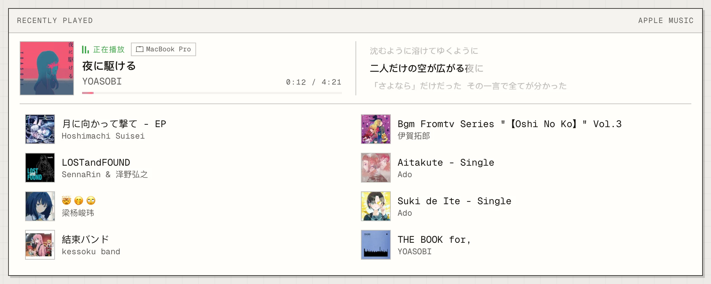
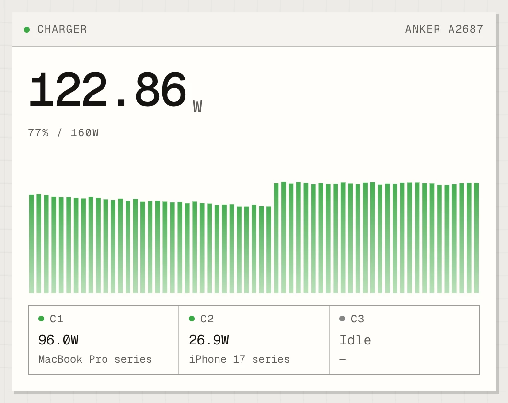
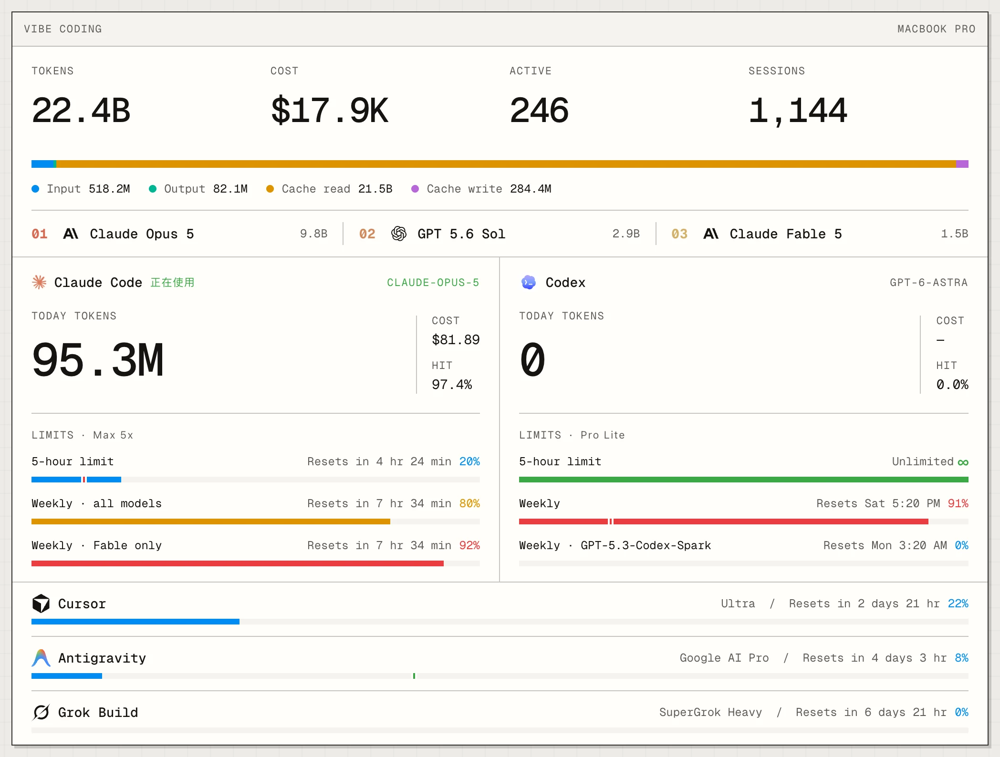

# lyjwpage

**一个由真实设备与日常活动驱动的个人主页。**

[在线访问](https://lyjw.me) · [中国大陆访问](https://lyjw131.com) · [交互式架构图](https://lyjw131.github.io/lyjwpage/)

听什么、看什么、玩什么，正在使用哪些应用，设备如何运行——这个主页把分散在 Mac、iPhone、NAS 和云端服务中的状态汇集到同一个页面。

它既是我的个人主页，也是一套持续演进的个人遥测系统。这个仓库记录网站源码，以及从设备采集、状态聚合到页面呈现的架构与实现。

## 页面里有什么

| 模块 | 展示与交互 |
| --- | --- |
| **音乐** | Apple Music 与 HomePod 播放状态、最近收听、逐字歌词和动态封面；访客可通过自己的 Apple Music 账号与订阅使用网页播放器和「一起听」。 |
| **影视** | Emby 正在播放与最近观看，呈现播放进度、剧集信息、画面与音轨规格。 |
| **游戏** | PlayStation 在线状态、游戏记录与奖杯进度，展开游戏卡片查看成就明细。 |
| **本机与充电设备** | Mac 前台应用，以及 Anker 充电器、充电宝的端口状态、电压、电流和功率变化。 |
| **AI Coding** | 编码工具的 Token 用量、API 等值成本估算、年度热力图与账号限额窗口。 |
| **运动活动** | 通过 iPhone 的 HealthKit 数据展示 Apple Watch 活动、锻炼与站立三环。 |
| **服务器** | 节点运行时间、CPU、内存与网络吞吐。 |
| **站点自身** | 网站版本、GitHub 仓库统计与最近提交，以及 Vercel 部署和 Cloudflare Workers 相关状态。 |

界面以灰阶、细线边界和卡片布局为基础，用等宽数字稳定动态指标的排版。颜色与动效主要服务于媒体内容、状态变化和交互反馈。

## 页面效果

首页是动态的：正在播放、正在充电、正在游玩这些卡片只在对应的事情发生时出现，平时看不到。下面的截图在本地用示例数据把这些状态同时点亮，明暗主题跟随系统。

<picture>
  <source media="(prefers-color-scheme: dark)" srcset="docs/screenshots/overview-dark.webp">
  
</picture>

**Emby 正在播放**：海报、剧集、进度，以及画面、音轨与码率规格。

<picture>
  <source media="(prefers-color-scheme: dark)" srcset="docs/screenshots/now-watching-dark.webp">
  
</picture>

**Apple Music 正在播放**：封面、来源设备、进度与逐字高亮的同步歌词，下方是最近收听。

<picture>
  <source media="(prefers-color-scheme: dark)" srcset="docs/screenshots/now-listening-dark.webp">
  
</picture>

**充电设备**：Anker 充电头各端口的功率、设备与协议，以及总功率曲线；充电宝的电量、收放电、温度与健康度。

<table>
  <tr>
    <td width="50%">
      <picture>
        <source media="(prefers-color-scheme: dark)" srcset="docs/screenshots/charger-dark.webp">
        
      </picture>
    </td>
    <td width="50%">
      <picture>
        <source media="(prefers-color-scheme: dark)" srcset="docs/screenshots/powerbank-dark.webp">
        
      </picture>
    </td>
  </tr>
</table>

**PlayStation**：在线状态、正在游玩的游戏、奖杯统计与最近解锁；展开游戏卡片查看奖杯组与逐条成就。

<picture>
  <source media="(prefers-color-scheme: dark)" srcset="docs/screenshots/playstation-trophies-dark.webp">
  
</picture>

**AI Coding**：各编码工具的 Token 用量、成本估算、今日用量与账号限额窗口。

<picture>
  <source media="(prefers-color-scheme: dark)" srcset="docs/screenshots/vibecoding-dark.webp">
  
</picture>

## 系统架构

系统分为三部分：**采集端适配不同来源，Cloudflare 统一管理状态，Next.js 负责页面呈现。**

<picture>
  <source media="(prefers-color-scheme: dark)" srcset="docs/architecture-dark.png">
  
</picture>

[打开交互式架构图](https://lyjw131.github.io/lyjwpage/)

**采集端**运行在数据产生的位置。Mac 采集本机应用、音乐、BLE 设备与编码用量，iPhone 读取运动活动，NAS 代理 Emby 播放状态，Linux 上报器提供服务器指标和 Agent 限额。Home Assistant 接入 HomePod 等家庭设备，独立 Worker 定时同步 PlayStation 数据。

**状态中枢**由 Cloudflare Workers 承担，负责接收上报、整合外部服务数据、提供公开状态 API 和实时推送。Durable Objects SQLite 保存快照与历史，R2 保存海报等图片资源；在线访客计数由独立 Worker 维护。

**展示端**运行在 Vercel。Next.js 生成首页时读取 Worker 的聚合快照，浏览器挂载后直接连接 Worker 获取最新状态，不再经由 Vercel 转发状态请求。中国大陆访问入口通过阿里云 ESA 加速页面与静态资源。

## 几个关键设计

### 首屏快照与实时更新分开处理

首页通过一次聚合读取取得各模块快照，使用 Next.js `use cache` 缓存，让首次展示不依赖浏览器逐张卡片请求数据。

页面加载后，实时数据由浏览器直连 Worker 更新。影响展示的变化会触发首页缓存标签失效并在后台重建，纯心跳不触发重建。

因此，缓存页面负责首次展示，客户端负责追上当前状态；不要求每次设备变化都同步刷新整页 HTML。

### 推送、轮询与本地推算各有分工

切歌、前台应用切换、设备插拔等事件通过 WebSocket 推送。多数事件直接携带新数据并写入 SWR 缓存，避免每个访客收到通知后再发起一次相同查询。

功率曲线、累计用量等连续指标按需轮询，播放进度则根据时间锚点在浏览器本地推算。轮询也为实时推送提供兜底；客户端的新鲜度检查防止较旧的轮询结果覆盖已收到的新状态。

### 不同来源共享状态与故障边界

设备协议和第三方接口由各自的采集器适配，页面消费统一的公开状态模型，不直接依赖家庭内网服务。

状态读改写在 Durable Object 内串行合并并持久化。单个数据源不可用时，通过统一的状态响应让对应卡片降级，而不是让整页等待所有设备在线。

上报写入需要鉴权，公开查询只返回明确的展示模型，服务端凭据与公开状态分开处理。

### 根据活动与访问情况调整开销

部分采集器根据设备活动和访客连接情况调整上报频率；浏览器标签页不可见时暂停状态轮询。WebSocket 使用 Hibernation API，让连接在没有业务事件时保持而无需实例持续运行。

实时推送连接与可见访客计数分别维护：前者关注状态同步，后者关注此刻正在查看页面的人数。

## 技术组成

| 层次 | 主要技术 |
| --- | --- |
| 页面与类型 | Next.js 16 App Router · React 19 · TypeScript |
| 样式与交互 | Tailwind CSS 4 · Motion · Number Flow · Geist |
| 客户端数据 | SWR · WebSocket |
| 状态与资源存储 | Cloudflare Workers · Durable Objects SQLite · R2 |
| 原生设备接入 | Swift / SwiftUI · HealthKit · BLE |
| 页面托管与分发 | Vercel · 阿里云 ESA |

## 从哪里读源码

| 想了解什么 | 阅读入口 |
| --- | --- |
| 首页如何组合各个模块 | [`src/app/page.tsx`](./src/app/page.tsx) · [`src/components/live/`](./src/components/live/) |
| 首屏如何读取和缓存状态 | [`src/lib/status-cache.ts`](./src/lib/status-cache.ts) |
| 推送与轮询如何更新同一份客户端状态 | [`src/hooks/use-live-events.ts`](./src/hooks/use-live-events.ts) · [`src/hooks/use-status.ts`](./src/hooks/use-status.ts) |
| 网页播放器与歌词如何工作 | [`src/hooks/use-web-player.ts`](./src/hooks/use-web-player.ts) · [`src/hooks/use-lyrics.ts`](./src/hooks/use-lyrics.ts) |
| 上报、状态存储与公开 API 如何组织 | [`workers/api/`](./workers/api/) |
| 各类设备与服务如何接入 | [`reporters/`](./reporters/) · [`workers/playstation-reporter/`](./workers/playstation-reporter/) |
| 在线访客如何统计 | [`workers/online-counter/`](./workers/online-counter/) · [`src/hooks/use-online-count.ts`](./src/hooks/use-online-count.ts) |

Mac 端采集器 [MacTelemetryHub](https://github.com/LYJW131/MacTelemetryHub) 独立维护，通过 Git submodule 接入 `reporters/mac-telemetry-hub/`。

## 进一步了解

[遥测与实时状态子系统](./docs/telemetry-subsystems.md) 记录各数据源的接入方式、通信协议与具体实现。

[Worker 数据后端与首屏缓存](./docs/state-storage.md) 说明状态持久化、公开数据边界、缓存失效与页面更新之间的关系。
