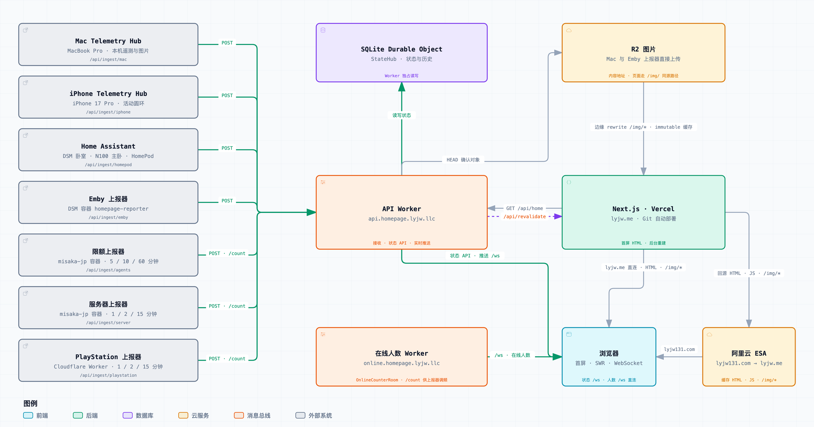

# lyjwpage

个人主页。信息展示 + 实时状态：**最近在看**（Emby）、**最近在听**（Apple Music）、**最近在玩**（PlayStation，点瓷砖展开该款奖杯明细）、**充电设备**（Anker Prime 160W 充电头 / A110G 充电宝）、**Vibe Coding**（Claude Code + Codex）、**活动圆环**（Apple Watch）、**落地节点**（Tokyo）。

## 技术栈

|      |                                                               |
| ---- | ------------------------------------------------------------- |
| 框架 | Next.js 16 App Router（Turbopack）                            |
| UI   | React 19 · Tailwind CSS v4（CSS-first，无 `tailwind.config`） |
| 动画 | `motion` · `@number-flow/react`（实时数字滚动）               |
| 数据 | Worker 状态 API + SWR 轮询 + WebSocket 推送             |
| 字体 | Geist Sans / Geist Mono（本地字体包，构建不依赖网络）         |

## 跑起来

```bash
pnpm install
```

```bash
cp .env.example .env.local
```

填好 `.env.local` 后：

```bash
pnpm dev
```

开发服务器固定使用 `http://localhost:3211`，避开已占用的 3210。

`pnpm dev` 连的是 `.env.local` 里的生产 Worker。改后端、加新的状态端点或新卡片时，生产上还没有那份数据，改用本地 Worker：

```bash
cp workers/api/.dev.vars.example workers/api/.dev.vars   # 填 GITHUB_TOKEN，其余默认即可
pnpm dev:worker          # 本地 api Worker，http://localhost:8788，状态持久化在 workers/api/.wrangler/dev-state
pnpm dev:worker:init     # 只需一次：空库不初始化会对所有查询回 503
pnpm dev:local           # 站点，同样是 3211，只是后端指向本地 Worker
```

本地 Worker 是空库，没有上报器往它推。`.dev.vars` 里的 `UPSTREAM_API_URL` 让它把自己答不上来的字段和端点用生产的数据顶上（只读），于是新端点看本地、旧数据看生产，页面上什么都有。三个配置在 `.claude/launch.json` 里也有（`api-worker-dev` / `lyjwpage-local`）。

## 海外部署与数据链路

Workers 是唯一数据后端：接收上报、持久化 Durable Objects SQLite、提供状态 API、获取并缓存外部数据，以及 WebSocket 和在线人数。Vercel 负责首屏 HTML、Next.js 页面缓存、静态资源和图片处理。`lyjw131.com` 经阿里云 ESA 回源 `lyjw.me`，ESA 缓存首页 HTML 和静态 JS。

<picture>
  <source media="(prefers-color-scheme: dark)" srcset="docs/architecture-dark.png">
  
</picture>

[交互版架构图](https://lyjw131.github.io/lyjwpage/) · [图源](docs/architecture.json) · [校验记录](docs/architecture.receipt.json)

在线人数由 `online.homepage.lyjw.llc` 独立提供；三个调频上报器分别读取它的 `online` 与 API 的 `connections`。

Vercel 没有状态 API 转发或私有存储读取端点。聚合快照只包含公开卡片数据，凭据仅留在 Worker。浏览器配置 `NEXT_PUBLIC_BACKEND_URL` 后直接查询 Worker，SWR 仍使用统一的路径键处理推送与轮询。

首屏使用 `use cache`：stale 5 分钟、revalidate 10 分钟、expire 7 天。内容变化按 `page:<tag>` 标记 stale，已有 HTML 先返回，更新在后台执行。纯心跳只续 SQLite 中的存活时间，不触发首屏失效；实时查询按当前时间判定新鲜度。

`shared/` 保存存储契约和共用计算，`workers/api/src/routes/` 提供公开 API。202 应答前确认持久化成功，之后使用 `waitUntil` 广播和通知 Vercel。上报在 StateHub 中串行合并，每个请求拥有独立工作副本。SQL 批次使用事务，定时清理过期数据。

发布和迁移步骤见 [状态存储架构](docs/state-storage.md)。三个 Worker 通过 [Cloudflare 原生 Git 集成](docs/workers-builds.md)自动部署，GitHub Actions 保留检查任务。生产使用 Vercel / Workers，腾讯云 EdgeOne 已退役；`lyjw131.com` 通过 ESA 加速 `lyjw.me`。展示变化落库后，API Worker 只通知 Vercel 标签失效；ESA 首页由控制台缓存规则「首页遵循源站缓存」按源站 SWR 头自行过期与后台取新，不走刷新 API；纯心跳不触发失效。Vercel 仍后台重建，两路通知成功不代表新 HTML 已同时生效，详见 [缓存通知契约](workers/api/README.md)。

## 状态是怎么接的

所有凭据只存在于服务端，浏览器只看得到 `/api/status/*` 返回的规范化数据。这些路由共用 `src/lib/api.ts` 的信封：上游挂掉时返回 `{ ok: false, error }` 而不是 5xx，让某一路数据源离线不至于把整页 SWR 打成错误态。

状态查询在 Worker 直读 SQLite，响应为 `Cache-Control: no-store`。新鲜度、播放进度和游标切片在每次查询时计算；历史数据不按游标另建缓存。Apple 目录、歌词、动态封面和 GitHub 数据的 TTL 缓存也只在 Worker。

七个上报来源共用 `/api/ingest/<来源>` 与鉴权密钥。PlayStation 每轮 presence 都落库续时，内容未变时不广播、不通知首屏失效。Mac / iPhone 空模块心跳同样只续时。缓存和上报验证见 [验证与发布](docs/state-storage.md#验证与发布)。

### 推给浏览器 — 自建 Worker

Worker 的 `src/fanout.ts` 将带数据的事件直接广播到 Durable Object。
浏览器直连 `/ws`，`hooks/use-live-events.ts` 将事件写入 SWR 缓存；站点不发布事件、不持有长连接。
页脚的「此刻在线」连接独立 `online-counter` Worker 的 `/ws`，`hooks/use-online-count.ts` 负责。

| 方法 | Worker 路径 | 用途 |
| --- | --- | --- |
| POST | `/api/ingest/<来源>` | Bearer 鉴权，接收数据、落库、广播与缓存失效 |
| GET | `/ws` | 浏览器收事件推送，页面开着就一直挂着；按 `ALLOWED_ORIGINS` 检查来源 |
| GET | `online.homepage.lyjw.llc/ws` | 「此刻在线」，页面不可见时站点整条关掉 |
| GET | `/count` | API 返回 `{ connections }`，独立在线人数 Worker 返回 `{ online }`，上报器据此调频 |

站点配置 `NEXT_PUBLIC_BACKEND_URL` 与 `NEXT_PUBLIC_ONLINE_COUNTER_URL`，分别拼接各自的 `/ws`。

这里从前走 Pusher 协议（云 Pusher，或自部署 [Sockudo](https://github.com/sockudo/sockudo)）。换掉的理由不是它不好用，而是这条链路上唯一还托在别人手里的一环：单条事件 10 KB 的上限就近在眼前（两张列表 4.4 KB / 2.8 KB），免费额度按连接数和消息数计，而在线人数那条当时已经在自己的 Worker 上跑着了。两条连接曾合并到同一个 Worker，现已重新拆开，各自使用一个 Durable Object：人数那个房间人一变就要广播、连接常驻实例、静默 90 秒就踢；推送那个房间走休眠 API，静默 5 分钟不计数、30 分钟才关。口径不同，清理策略也不能共用。

推送房间的连接走休眠版的 `ctx.acceptWebSocket()`，心跳用 `setWebSocketAutoResponse` 由运行时直接回 —— 这些连接绝大多数时间空转（上报器几十秒才来一条），实例可以被回收、连接照样挂着。

推送上只跑「状态翻面」：换前台应用、换曲子、插拔充电头、上报器上下线、两张列表变了。滚动读数（功率曲线、token 用量）仍由卡片自己 30 秒一轮地取 —— 推它们等于把推送当轮询用。丢一条也不至于卡住页面，轮询是兜底。

事件名和 `/api/status/*` 的路径一一对应：**`X` 是列表，`X-now` 是此刻**。带不带数据分两类：

| 事件 | 形状 |
| --- | --- |
| `desktop` · `listening-now` · `watching-now` · `playing-now` · `charger` · `listening` · `watching` · `playing` | 带数据，浏览器直接写进 SWR 缓存 |
| `presence` | 只发失效通知（payload 为 `null`），浏览器自己回来取 |

**一律带数据。** 两张列表曾经只发失效通知，理由是「整份太大」——实测 4.4 KB 和 2.8 KB，而发通知之后浏览器照样把整份取回来，字节一点没省，反倒多出一次请求头、一次往返、一个函数调用和一次 SQLite 读，**而且是按在线人头乘的**。（那时的天花板是 Pusher 单条 10 KB，只有两倍余量；现在是 Cloudflare 单条 WebSocket 消息 1 MiB。）

只有 `presence` 仍是失效通知：它翻的是「上报器还在不在」。亲口离线是布尔值，浏览器要重取 `declaredOffline`；超时那条拿 payload 里的 `lastSeenAt` 和 `heartbeatWindowMs` 自己就能翻，源站不再算 `stale`。窗口默认 5 分钟（约三倍心跳），可用 `HEARTBEAT_WINDOW_MS` 改。

充电头那条带状态但**不带历史点**，是另一回事：曲线是增量同步的，服务端不知道各客户端的游标，只能要么整份重发要么发空增量。列表是整份替换，没有游标这回事。

两张列表的轮询兜底因此放到了 5 分钟一轮 —— 即时性由推送负责，轮询只兜「推送整体停用」这一种情况。

### 最近在看 — Emby

**本站不向 Emby 发任何请求。** 站点将来要部署到 Vercel，那时它够不着局域网里的 Emby（`http://emby.local:8096`），所以续播列表、播放位置和海报全部由 NAS 上的推送代理送进来：

```text
POST /api/ingest/emby
Authorization: Bearer <TELEMETRY_INGEST_SECRET>
```

代理的代码、配置和部署方式在 `reporters/emby-reporter/`。请求体的三部分都可省略、各推各的：`resume`（续播列表，60 秒一轮、有变化才推）、`playing`（播放位置，连同客户端、设备、播放方式和选中音轨 / 字幕的规格；缺席表示这次不谈、显式 `null` 表示确认没人在看了）、`images`（`{ imageKey, objectKey }`，代理直传 R2 之后回报的对象键，只带站点还没有的那些）。

**Emby 的播放通知也先发给代理，再由它转发过来。** Emby 后台那个 webhook 配置项加不了自定义请求头，直发站点就只能开一个不鉴权的入口 —— 这个路径从前就是那样直收 webhook 的，那条路已经删了，现在站点只剩 `TELEMETRY_INGEST_SECRET` 一种鉴权方式。Emby 侧该怎么填见代理的 README。

推送只在开始/暂停/继续/停止、以及代理发现**拖了进度条**时才来，中间没有消息。但每条都带着当时的播放位置和总时长，所以未暂停时按真实时间往前推算即可 —— 进度条不轮询也能走。这同时兼作兜底：推算位置超过总时长说明播完了而「停止」没收到（客户端崩了、网络断了），此时按已结束处理，不会一直挂着。

Emby 对拖动进度条不发任何通知，那部分只能查会话。查的人是代理不是站点：它在播时每 2 秒问一次 `/Sessions`，但只在位置偏离站点的推算值超过 1.5 秒时才推 —— 站点算得准的时候推它等于白花一次函数调用。

播放中那一集单独一张「Now Watching」卡（`components/live/now-watching-card.tsx`），占卡片网格第二行整行、在充电卡和最近播放上面，和 PlayStation 那张同一套骨架：卡头一盏灯跟播放走（在播绿、暂停黄），里面是横版剧照、标题、**在哪放、放的是什么规格**、副标题行右侧的时长和单独一条走动的进度。没在播时整张卡收起、不占位；续播瓷砖行仍是下面「最近在看」那条分区，播放中那集照旧置顶并带角标。卡片的数据在 `playing` 里：`client` / `deviceName` 是会话原样给的客户端和设备名，`playMethod` 是直接播放 / 直接串流 / 转码，`media` 是容器、码率、视频的编码 / 尺寸 / 动态范围 / 位深、会话选中的那条音轨和选中的字幕。这些都是代理从 `/Sessions` 和条目详情里挑出来的原话：编码名小写、语言是 Emby 的代码、动态范围按 `ExtendedVideoType` 归成 `hdr10` / `hdr10plus` / `dolby-vision` / `hlg`（老字段只有 `hdr` / `sdr`）；「1080p · H.264 · DD+ 5.1 · 中文字幕」这些标签由浏览器现拼（`lib/watching-media`），Emby 那些本地化过的 DisplayTitle 不进来。流列表整份不出代理 —— 一个条目动辄二十几条字幕流，外挂字幕还带着 NAS 的 SMB 路径。中途切音轨或字幕，代理按签名变化推一次；转码时 `media` 里仍是源文件的规格，不是转出来的。

状态存在 SQLite（`lib/emby-store.ts` 的 mirrorKey，SQLite 为主、进程内存为辅），站点不再向 Emby 拉任何东西。读路径上 `/api/status/watching` 和 `/api/status/watching/now` 由 Worker 直读 SQLite，和别的状态接口同一套。前端契约没变，两条仍是分开的：前者跟着 60 秒的推送走，后者跟着播放事件走，合在一起的话慢的那半只能跟着快的那半一起被重取。

剧集自身的 `Primary` 图是剧照而不是海报，所以竖版海报优先取所属剧的 `SeriesPrimaryImageTag`。这个选择在代理那侧做 —— 字节是它下载的，挑哪张的逻辑跟着走才不会分家。

#### 图片

海报由 Emby 上报器一次压成 WebP，以 `<sha256>.webp` 直传 R2；站点只接收对象键，响应时再用当前部署的 `R2_PUBLIC_BASE_URL` 拼公开地址。图片通过 R2 自定义域直接交付。上报器传之前先 HEAD 问一次桶里有没有，所以桶被清空、换机器、重启都能自己发现要补传，不必等站点回执。地址即内容指纹，所以对象带 `max-age=31536000, immutable`，浏览器直连交付域取图，站点没有图片读写或转码路径。

- **条目里存的是「图片键」而不是地址**（`imageKey`，由代理按 `itemId:kind:tag:height` 拼，图换了 ImageTag 键就换），读取时才换成地址。图片和列表是分两次推来的：列表先到、图片可能还在路上，或者 SQLite 被清空后只需补图。晚到的那批图能把已经存着的列表一起点亮，不用整份重推。
- **响应里回 `missingImages`**：站点引用了却没有的键。代理据此补传，SQLite 清空、容器换机器之后不需要人工干预。
- **上报器直传图片**：Emby 海报在代理侧用 sharp 压成 `<sha256>.webp`、Mac 图标用系统原生编码器压成 `<sha256>.png`，都由上报器直传 R2。Worker 只 HEAD 校验并保存对象键，公开 URL 在读取时按部署环境组装；SQLite 里不存完整 URL 或任何图片二进制。HEAD 结果只缓存 5 分钟——桶被清空后 Worker 要能重新发现对象没了，否则会一直发指向已删对象的 URL。

> 卡片的「在 Emby 里打开」跳转链接指向 `EMBY_PUBLIC_URL`，源站地址会出现在页面 HTML 里 —— 这是有意为之，不用改：Emby 前面有认证网关，跳过去的人会撞到认证。没配这个变量就不给链接，没有内网地址可退，退了也是个点不开的链接。

Apple Music 的封面没有代理，仍走 `mzstatic.com` 直链 —— 那本来就是公开 CDN，套一层反而多一跳。

### 最近在听 — Apple Music

列表由 API Worker 请求 `/v1/me/recent/played`（`workers/api/src/apple-music-recent.ts`），写入 SQLite 后推送浏览器并使站点缓存失效。

**为什么当时要一个常驻进程。** 因为那时这份列表还兼着推断「此刻在不在听」：Apple 没有可查的当前播放接口，只能连续盯着列表里排第一的那项什么时候换人，再对照容器总时长猜它有没有播完。连续观测这件事在 serverless 上做不了——状态存在进程内存里，每个实例各有一份、活不到下一次切换。**那个推断已经撤掉了**，于是常驻的理由也没了。

**为什么撤掉它。** 它只在 Mac 和 HomePod 同时没声时才可能露面（有实况就以实况为准），而那正是它最没把握的时候：一直循环同一张专辑时第一项不变，会被当成已经停了；只听了一首就走开，仍按整张时长算，能一直显示在听；停下来但没换过东西的情况根本分辨不出来。卡片上那枚 `inferred` 角标就是在说「这一句我也不确定」。**现在「在不在播」只认设备实况**，这份列表只回答「听过什么」。

刷新由 API Worker 驱动：WebSocket 建立时检查，cron 每分钟在有存活连接时检查一次；SQLite 两分钟闸门限制真正的拉取。无人连接时不拉取。新列表通过 Worker 推送和缓存失效送到页面，状态 GET 只读取已写入的数据。

TTL 定在分钟级不是为了「在听」的精度（那个已经没有了），是为了 hero 那条取色带：实时播放的封面配色是拿当前专辑 ID 去这份列表里借的，刚开播的那张要等它进了列表才有颜色可借。两分钟落在一首歌之内。

顺带纠正一个当时写在这儿的说法：闲时那 96 次/天**不是**在记录历史。站点每次都是整份替换、不累积，而 `/v1/me/recent/played` 本身就是 Apple 存着的历史，什么时候问都在。

需要 **Developer Token** 和 **Music-User-Token** 两条凭据，**全部由 Mac 上报器推来**：Mac Telemetry Hub 用本机 MusicKit 现签一对，作为 `appleMusicCredentials` 模块随 `/api/ingest/mac` 的信封送上来。`.p8` 私钥留在那台机器的钥匙串里由系统保管，服务器上一份都没有，本站也不含任何 JWT 签名代码。

MusicKit 签出来的 developer token 寿命约一个月（**Apple 没承诺这个数字**，实测在 29～30 天之间浮动过），上报器从它自己的 JWT 解出 `exp`，过了「上报时刻 → 到期时刻」的中点就重签重发。取相对中点而不是写死提前量，正是因为寿命不由 Apple 承诺，写死在两个方向上都可能错。实践中上报器重启比半个寿命周期频繁得多，所以多数情况是每次启动重传一份新的。Worker 只管收下最新的一份，不做提前判断——用的时候手上是哪份就用哪份，被 Apple 拒了就是这一轮作废。

凭据存 SQLite，和 `telemetryState` 严格分开 —— 后者会经 `/api/status/*` 发到浏览器。那个 ingest 路由也不打印请求体。

**没有服务端自签的回落。** 有回落就意味着私钥仍得躺在服务器上，这套东西就白做了。代价是 Mac 上报器长期离线且 SQLite 也丢了凭据时「最近在听」直接失败，这是明摆着的取舍。

**这份凭据也不从任何端点发出去。** 从前 `GET /api/ingest/apple-music` 把它转交给拉列表的上报器，代价是 `TELEMETRY_INGEST_SECRET` 从此和收听记录同等敏感（拿到密钥就能取走 token）；拉列表迁入 Worker 后，那条路和那个代价一起没了。

拉的是 `/v1/me/recent/played?limit=10`。注意这个端点返回的是**专辑、歌单、电台这类容器**，不是单曲：专辑给 `artistName`、歌单给 `curatorName`，没有 `durationInMillis`，`limit` 上限是 10。时长要顺着容器的 `href` 再查一次曲目加起来（缓存 24 小时），封面对自建歌单还要去资料库副本取（缓存 12 小时，那是个 24 小时到期的预签名地址）——所以稳定状态下一轮刷新只有拉列表那一次真的出网。

刷新的闸门是 `lib/cache`：TTL 全站共享一份、in-flight 去重挡同一实例的并发穿透。**上游报错也盖同一个戳**——不然 5 秒负缓存一过值那半仍是空的，下一次请求又是一次真的上游调用，Apple 正病着的时候反而比正常快一个数量级。落库之后只在内容真的变了时才往浏览器推、才失效缓存，没变的那几轮什么都不做。

站点会打 Apple 的第二处（除了下面两节的动态封面和歌词，那两条走的是 amp-api）是「此刻在播的那首曲子」的跳转链接：Music.app 和 HomePod 都给不出可分享的链接，只能拿曲名 + 艺人现查目录，而这件事跟着当前播放走，和按固定节奏刷的列表不是一回事。命中缓存 7 天，绝大多数请求不会真的出网。要搬走该搬去 Mac 上报器——那边有 MusicKit，换歌那一刻就能把链接一起算好。两处共用 `lib/apple-music` 里的同一把凭据和同一个请求外壳。

### 跟着进度走的歌词 — amp-api

hero 上此刻在播的那首，副标题那一行会跟着进度条换成正在唱的那句；前奏、间奏、没有歌词的曲子和历史条目仍是艺人名。不另起一行：hero 的 80px 已经用掉 76px，两版 hero 的高度又必须一致。

**歌词只在 amp-api 上有，而且要两把钥匙一起。** 公开目录 API（`api.music.apple.com`）不给歌词；`amp-api.music.apple.com/v1/catalog/{sf}/songs/{id}/lyrics` 是网页播放器自己用的内部端点，`Authorization` 要的是从 `music.apple.com` 的 JS bundle 里扒出来的 web token（和动态封面同一份，扒取、SQLite 共享、401 作废都在 `lib/apple-web-token`），订阅身份走 `Media-User-Token` —— 就是上面 Mac 上报器推来的那份凭据里的 music user token。缺后者时 amp-api 回的不是 401，而是和「这首歌没有歌词」**一模一样**的 404，所以「没有」只缓存一小时，有词的缓存 7 天；目录查询那一步顺手带回 `hasLyrics`，目录说没有的浏览器根本不问。

先要字级（`/syllable-lyrics`，`itunes:timing="Word"`，每个字一个带 begin/end 的 `<span>`），404 再退回行级（`/lyrics`）。字级那份的每句多一个 `words`，hero 上那一句按字从左到右点亮：每个字一个 span，`--sung` 是唱到了几成，CSS 把「已唱 / 未唱」两色渐变裁进文字（`.lyric-word`），播放中 rAF 每帧直接写 DOM，不走 React 重渲染。只有行级的歌整句一起亮。TTML 解析在 `lib/lyrics-ttml`（`<head>` 里的翻译不当成行，`x-bg` 和声整层丢掉，字间空格挂到前一个字后面所以 words 拼起来就是整句），哪句该亮在 `lib/lyrics-cue`，两个都是纯函数、都有测试。换句那一刻由一个定在边界上的闹钟驱动，不靠进度条那个整秒计时器；position 和进度条、字的点亮、「一起听」读的是 `lib/track-position` 同一份算法。响应 `no-store`，浏览器不留；同一页里 `hooks/use-lyrics` 按 songId 只问一次，模块级缓存兜着。

**`GET /api/lyrics?song=<目录曲目 ID>` 和 `GET /api/motion-artwork?url=<链接>` 按参数答；不带参数答的是此刻在播那首。** 带参那条是给网页播放器的：访客在自己那边放「最近在听」里任意一张专辑的任意一首，服务端的「此刻在播」快照说的是主人的歌，帮不上他。带参响应按 URL 缓存，浏览器和 CDN 都存（`public` + `s-maxage`）：一首歌的歌词、一张专辑的动态封面都不会变，有的存 7 天 / 24 小时，「没有」只存 1 小时，和 SQLite 那层同一个尺度。09-03 曾把参数拿掉、改成服务端自决，为的是关掉「任意 ID 换歌词」这个公开代理；09-07 按需求开回来，从前那道「只答此刻在播和排在后面几首」的白名单没有恢复 —— 播放器要放整张专辑，名单圈不住。Worker 统一用 CORS 校验浏览器来源；公开接口不以来源检查作为秘密鉴权。不带参的问法留给卡片 hero：服务端读和 `/api/status/listening/now` 同一份快照、同一种取法（`lib/now-listening-read`，否则会「那边已是新歌、这边还是旧的」），自己决定取哪首，响应随时间变所以 `no-store`。两种问法响应都带 `songId` / `link` 让浏览器对号，对不上只挡 5 秒再问。目录说 `hasLyrics` 为 false 的不去问 Apple；浏览器那侧「没有」只记一小时，和服务端同一个尺度。

### Web 播放器与一起听 — MusicKit

「一起听」只在 Web 播放器内的 BETA 标签旁提供同步按钮。卡片右上角显示「Apple Music」，点击当前歌曲的封面、标题或历史条目会打开普通专辑播放器，不自动开启同步；一起听需在播放器内手动开启。开启后，访客用**自己的** Apple Music 订阅授权，在统一播放器中同步此刻的歌曲、后续播放列表和进度；关闭同步保留当前播放。手动播放、暂停、切歌、选择队列歌曲或拖动进度会退出同步，浏览其他专辑和关闭弹窗不影响跟随。页头缩略播放器与展开页共用播放状态。站点不转发音频，播放发生在访客和 Apple 之间。

**我的凭据碰不到这条路径。** 上面那份 Mac 推来的 token 带着 `Music-User-Token`，拿到就能读我的收听记录，所以它只留在 Worker 的 SQLite 中，不经公开端点发出。跟听要的是另一种东西：一份发给**任意访客**的 developer token，访客拿它去换自己的用户令牌。两者敏感度差一个量级，不共用一条路径，也不共用一把锁。

**签发在 api Worker 的 `GET /api/musickit/token`**（`workers/api/src/musickit-token.ts`）。私钥不进站点的运行时 —— 站点部署在 Vercel，函数实例、构建日志、预览环境都能碰到那份环境变量；Worker 这条路径只有一个出口、只吐一份有期限的令牌（默认 7 天，`MUSICKIT_TOKEN_TTL_SECONDS` 可改）。`.p8` 走 `wrangler secret`（`APPLE_MUSIC_PRIVATE_KEY`），Team ID 和 Key ID 不是秘密，放 `[vars]`。从前是单独的 musickit-token Worker，09-07 并进来：来源名单、CORS 和域名本来就和 api 共用一份，两个 Worker 各抄一遍只多出一处要同步改的地方。

**续期看半衰期**：过了「签发 → 到期」的中点就换一份新的，Worker 的缓存和站点的内存副本用的是同一条规则（两边都叫 `pastHalfLife`），所以响应里 `issuedAt` 和 `expiresAt` 一起给 —— 只给到期时刻的话，站点只能拿「我什么时候收到的」当起点，而收到的可能已经是 Worker 缓存着的、用掉一半的那份。取相对中点而不是写死提前量：写死的那个在两个方向上都可能错。Worker 自己调 Apple Music API（找曲目链接、拉最近播放）用的是同一把钥匙另签的一份、不带 origin 声明的令牌（`issueApiDeveloperToken`），同样过半衰期换新；Mac 上报器只推 music user token，不再推会过期的 developer token。

**域名限制是一份名单、两道闸**，都由 Worker 的 `ALLOWED_ORIGINS` 配：

| 闸 | 拦什么 | 谁校验 |
| --- | --- | --- |
| `Origin` 头比对 | 谁能来要令牌。配了名单之后不带这个头一律拒 | Worker |
| JWT 的 `origin` 声明 | 令牌只在这些域上有效，复制到别处就是废的 | Apple |

第一道只是让「拿一份」不那么随手 —— Origin 头是请求方自己写的，非浏览器伪造得了。**真正兜底的是第二道**，就是用 `.p8` 签的时候把允许的域写进 JWT。Apple 不解析通配符，所以 `https://*.vercel.app` 这类只参与第一道；通过之后签进声明的是**这次请求那个具体来源**，预览域名和 localhost 因此都能用，而声明始终是一串写死的完整来源。

**跟随由锚点变化驱动**，四件事：换歌重排队列并从对应进度起播；主人暂停跟着暂停；主人续播对齐再放；主人拖进度就地重新对齐。另挂一个 20 秒的慢速巡检，兜住访客那侧缓冲卡顿慢慢攒出来的偏差。差在 5 秒以内不动 —— 每次 `seek` 本身要重新缓冲，抖来抖去反而把差距拉大。

进度推算和 hero 的进度条**共用 `lib/track-position.ts` 一份算法**。两边各写一遍的话，页面上画到 1:23 而访客耳朵里在放 1:19，还没法一眼看出是谁错了。

点播要的是**曲目** ID，不是专辑 ID。目录查询本来就命中了那首曲子（为了拿链接），`hit.id` 顺手带出来就是，经 `TrackLookup.songId` 到 `NowListeningPayload.songId`。注意它和并排的 `id` 是两个东西：后者是所属的专辑 / 歌单，和 `/api/status/listening` 的 `items[].id` 对应。

两条明摆着的取舍：

- **换个国家可能就没这首。** `songId` 按站点的 `APPLE_MUSIC_STOREFRONT` 解出来，各地授权范围不一样，访客那边查无此曲时按钮翻成「重试」并说明原因，不静悄悄地什么都不放。
- **令牌 7 天到期。** 不取 Apple 允许的半年上限：它发给任何一个打开页面的人，域名限制之外就只剩有效期这一道闸。过了半衰期（3.5 天）再开始跟听会自动换一份新的，所以正常用不会碰到边界；但**同一个页面挂着不动、跟听中途跨过到期时刻，那一次播放会断** —— 已经配好的 MusicKit 实例不会中途换令牌。

签发地址从 `NEXT_PUBLIC_BACKEND_URL` 拼出来，没有单独的变量；不配它则整个功能停用，右上角照旧显示「Apple Music」，卡片其余部分不受影响。

### 充电设备 — Anker Prime 160W 充电头 / A110G 充电宝

两台是同一个 `chargingDevices` 模块里的两项，靠 `kind` 区分，各自落库、各自推送；
只开其中一个模块是正常情况，列表里少一台不影响另一台。下面先说充电头，充电宝那半
在本节末尾。

数据来自 a2687-telemetry，它通过 BLE 读充电器、以 HTTP 暴露快照。`GET /status` 一次拿到整机功率 + 三个 USB-C 口的电压/电流/功率/协议/线缆/设备识别。

**本站不轮询充电头，只接收统一遥测推送。** Mac Telemetry Hub 从本机 a2687 服务读取 `/status`，把精简后的状态放进 v4 envelope，只 POST 到 `/api/ingest/mac`，并使用 `TELEMETRY_INGEST_SECRET` Bearer 鉴权。旧的 `/api/ingest/charger`、`/api/ingest/telemetry` 和 `/api/ingest/presence` 入口都已经删除，没有兼容路径，也没有本地轮询回退。

卡片**不主动**连本机端口。在这台 Mac 上打开 `/local/charging` 才会去连 `http://127.0.0.1:8787/sse/charger` 和 `/sse/powerbank`：端点往 localStorage 写一条记录再跳回首页，这台浏览器以后进站都会连。连上就改用这条约 1 Hz 的本机推流，不再用远端那份；连不上立刻放弃、不重试，远端照旧。

**总功率历史存在服务端**（`lib/charger-store.ts`，Worker SQLite；存储不可用时请求失败）。客户端自己累积的话页面一刷新曲线就没了、还要攒很久才有形状。环形缓冲保留 400 点，两点之间至少间隔 `MIN_SAMPLE_GAP_MS`（当前 5 秒），足以覆盖固定 20 分钟图表窗口。

曲线的横坐标**按时间戳映射**而不是按序号等距铺开 —— 漏推一次就会有空档，等距会把那段画得和正常间隔一样宽。

超过 3 倍推送间隔（且至少 90 秒、也至少一个心跳窗口）没收到新数据就标记为断流，此时不再声称充电器在线，否则页面会一直显示旧的瓦数。「也至少一个心跳窗口」是必须的：安静时段没有新读数可发，续这条时间戳的就是那封纯心跳，窗口短于心跳间隔的话卡片会周期性闪回「未连接」。

几个上游的脾气：

- `connected`（BLE 链路）和 `mode`（某个口是否在输出）是两层状态，UI 要分开处理
- 上游把 `"N/A"` 当占位符大量返回，必须过滤，否则界面上会出现一堆 N/A
- `ports` 的 key 顺序不保证，必须按 key 取
- 设备名靠 (VID, PID) 查表，表是逐条实机观察积累的。查不到时显示 `Unknown`（口空着才显示 `—`）
- **没有温度字段，上游也不给历史** —— 曲线是本站自己攒的

**充电宝（A110G）** 走完全相同的来路：同一台 Mac 把 BLE 解出来的读数塞进
`chargingDevices`，本站按 `kind` 挑出来，落在 `lib/powerbank-store.ts`（Worker SQLite 持久化），读取走 `/api/status/powerbank`，卡片是 `components/live/powerbank-card.tsx`，
本机浏览时同样是打开 `/local/charging` 才直连 `/sse/powerbank`。收卡口径也和充电头一致：上报器离线、或者超过
`powerBankStaleAfterMs()` 没收到新推送，就把 `connected` 打成 `false`，浏览器不再自己算
一遍过期。那个窗口和充电头的 `chargerStaleAfterMs` 逐字对齐：默认 90 秒，但也不能短于
`CHARGER_PUSH_INTERVAL_MS` 的 3 倍、更不能短于心跳窗口（默认 300 秒）—— 安静时段没有新
读数可发，窗口比心跳间隔短的话卡片会周期性闪回「未连接」。

两处不一样：① **不存历史**。功率每帧都在跳、形状有信息，所以充电头那条曲线值得攒；
电量以小时为尺度变化，画出来几乎是条水平线，卡片上也就没画 —— 既然没人消费，采样间隔、
裁剪、TTL 那一整套就都不该存在。② 即时推送的触发条件是插拔、充放电切换、热控翻转和
整数电量跳格（外加插拔之后那段收敛窗口）；缓慢滚动的电量和功率仍然等卡片下一次轮询。

### Vibe Coding — 本地日志与云端用量

**用量**由 Mac Telemetry Hub 直接采集：Claude Code、Codex、Grok 等来源读取本地日志，
Cursor 的用量历史从账号云端获取；本地会话活动只用于判断“正在使用”，不能替代 Cursor 的
云端 token 历史。采集器按来源保存历史，再从同一份日数据生成累计、今日用量、模型排行和年度图。
**套餐与限额窗口**继续由 NAS 上的 `reporters/agent-limits-reporter` 走 `/api/ingest/agents`
独立上报；Mac 用量报文不带 `plan` / `limits` / `limitsError`。

Mac 信封保持这三个模块：

| 模块 | 间隔 | 内容 | 站点怎么处理 |
| --- | --- | --- | --- |
| `vibeCodingNow` | 60 秒 | 此刻是否活跃、当前模型、最近活动时刻 | 变了推 `vibecoding-now` 事件 |
| `vibeCodingUsage` | 10 分钟 | 各来源今日用量与采集状态，累计 token、API 等值费用、活动天数和会话数 | 保存摘要并失效首屏缓存，卡片轮询 |
| `vibeCodingYear` | 1 小时（可改） | 过去 53 周的日总量及每天前五模型 | 保存完整 371 天窗口；GET 和浏览器刷新都取整份 |

主要来源 id 为 `claude`、`codex`、`cursor`、`grok`、`antigravity`，采集器还可按相同契约增加来源。
每行 `today` 可以为 `null`，
表示尚未取得用量；成功采集的零用量仍用数字 `0`。每行必须带 `usageStatus`：

```text
{
  state: "ok" | "error" | "unavailable",
  collectedAt: ISO8601 | null,
  error: string | null,
  coverageStart: "YYYY-MM-DD" | null,
  coverageEnd: "YYYY-MM-DD" | null,
  precision: "measured" | "estimated" | "mixed",
  costComplete: boolean
}
```

`collectedAt` 是该来源最后成功采集时间；失败时保留旧时间、覆盖范围和已保存的历史，
只改变来源状态和错误。摘要顶层 `collectedAt` 是本轮摘要生成时间，不能拿它给失败来源续期。
日期统一按 `Asia/Shanghai` 分桶。`activeDays` 是所有来源已有历史中非零 token 日期的并集，
不是各来源天数相加，也不限定为热力图的 53 周。覆盖范围只代表原始来源当前能取得和已保存的历史，
不承诺云端提供永久全量历史。

`totals.costComplete` 为 `false` 时，`apiEquivalentCostUSD` 只汇总已知价格的部分；
费用完整性保留在数据契约中，页面不单独标记。未知模型的价格不能当成零费用。
来源采集状态和诊断信息保留在数据契约中。页面直接展示已有用量，缺值显示 `—`，
不附加采集、保存或估算提示；限额仍按自己的成功时间展示。

站点按 id 合并用量与限额，只有限额的来源也会显示。完全没有用量摘要时，status 的 `totals`、
`collectedAt` 和 `pushedAt` 为 `null`，页面显示“等待用量上报”，不伪造累计零值。
首页不展示 `opencode` 和 `pi` 来源行，API 和历史汇总仍保留这些数据。
网站只接收采集器准备好的摘要，不运行本地日志解析或 Cursor 云端认证。

年度图每次刷新完整窗口，云端补回或修正的旧日会直接替换浏览器已有格子。
`/api/status/vibecoding/year` 不再使用 `since`、`daysPartial` 或 `from`；GitHub 贡献图的增量机制不变。

切换采集器前应备份旧摘要与可导出的逐日历史，核对各来源 token、非零日期、会话数及费用覆盖；
本站 SQLite 里的累计摘要和每日前五模型不能还原完整逐来源明细。新用量报文要求来源状态和费用完整性，
旧摘要不作为新协议读取，首份新摘要到达前仍可展示独立上报的限额。

本地端到端回归使用 `node scripts/verify-api-worker.mjs`，脚本启动独立 SQLite Worker，
自动覆盖用量协议、纯心跳、并发合并和重启持久化。手工运行用量回归时，目标必须是空的本机测试 Worker，
配置独立 `STORAGE_PREFIX` 与 `TELEMETRY_INGEST_SECRET=local-token-usage-verification`：

```sh
node scripts/verify-coding-usage.mjs \
  --ingest http://127.0.0.1:8787 \
  --base http://localhost:3211 \
  --storage-prefix token-usage-dev-20260905
```

脚本拒绝非本机目标和未明确标识为测试的前缀，不读取 `.env`，也不清空已有用量。
它验证鉴权、旧协议拒绝、仅有限额、未知用量与真实零、重复上报、独立 now 更新、
非法年度模块不部分写入、371 天整份刷新及旧日上调/下调。可用 `--snapshot` 传入 Mac CLI
`{ usage, now, year }`，结束后留下该输入或合成基线及测试限额。首屏缓存另由
`scripts/verify-status-cache.mjs` 在独立测试部署验证，不能对正式站注入测试状态。

### 各 agent 的限额 — 容器上报器

```text
POST /api/ingest/agents
```

请求体是 `{ collectedAt, agents: [{ id, plan, limits, limitsError }] }`，字段含义就是
`src/lib/types.ts` 里 `VibeCodingAgent` 上同名那几个。一封只带这次采集到的 agent，**没出现
的 id 站点不动**（按 id 合并进 `vibecoding:limits`）；某家没登录就不发那一行，登录了但取
不到就发空 `limits` 加 `limitsError`，页面据此把「没配」和「配了但取不到」分开。取失败时
不要把上一次的好值再发一遍，站点自己留着。

**每轮必发**，内容没变也发 —— 那一封就是心跳。站点给每行盖 `limitsAt`（收到的时刻），
采集采用[同款三档](#三个上报器共用一套三档)：可见 5 分钟、仅开着 10 分钟、无人 60 分钟。
站点把最慢档三轮加余量的窗口（`AGENT_LIMITS_STALE_MS`，默认 185 分钟）作为
`limitsStaleAfterMs` 一起发给浏览器，陈旧与否浏览器自己算：条照画、数字停在最后一次看到
的值，但整块淡掉并标 Stale。不在服务端拼「N 分钟没更新」—— 首屏是 `'use cache'` 冻住的。
这一路不走实时推送，卡片 30 秒一轮自己来问。

容器里各家 CLI 各登录一次，凭据落在自己的卷里，**不拷 Mac 的凭据** —— 两份 refresh token
各自刷新会互相作废。Claude / Codex / Grok Build 由上报器自己拿各家 CLI 的登录态打各家的用量
接口（直接读取官方 CLI 的登录态）；Cursor 和 Antigravity 的接口是抓 CLI
的 `/usage` 抓出来的，同样直打。五家的登录都在容器里做一次。部署、登录步骤和环境变量见
`reporters/agent-limits-reporter/README.md`。

卡片顶部汇总全量 token、API 等值费用和活跃天数，并按 input、output、cache read、
cache write 展示占比（信封里另有 reasoningTokens，尚未上屏）；下方展示 Claude Code 和 Codex 的今日 token、
缓存命中率、历史主力模型、套餐，以及统一的 5-hour limit 和 Weekly 两条。某一槽没有窗口
就显示 Unlimited。年度 token 热力图和 GitHub 贡献图合在联系卡里，用 Tokens / Commit
切换；格子悬停显示当天总量和前五模型。Cursor、Grok Build 和 Antigravity 同一份数据里也有
token 明细，首页只取用量最高的那一扇限额窗口画一条进度。最近活动时刻由会话摘要
提供，用于真实的“正在使用”状态。

费用是公开 API 价格的等值估算，只表示这些 token 如果走 API 的价格，不是
Claude/Codex 订阅账单。上报摘要不含提示词、回复、session ID、项目名或文件路径。

### 本机实时活动 — Mac Telemetry Hub

源码在 `reporters/mac-telemetry-hub`（以子模块引入自 [LYJW131/MacTelemetryHub](https://github.com/LYJW131/MacTelemetryHub)）。

`a2687-telemetry/A2687TelemetryMac` 已从单一充电头工具扩展为可插拔的本机遥测中心。充电头、前台应用、本机 Apple Music、Mac 时区和 vibe coding 都能独立开启或关闭。Apple Music 通过 macOS Apple Events 读取 Music.app 的本机播放状态，与上面的 Apple Music API“最近在听”完全独立。

所有采集器统一写入：

```text
POST /api/ingest/mac
```

请求采用唯一的 `version: 4` envelope，顶层带 `heartbeatAt`、`presence`（`online` / `offline`）和 `activeModules`；模块名固定为 `chargingDevices`、`desktop`、`appleMusic`、`appleMusicCredentials`、`timezone`、`vibeCodingUsage`、`vibeCodingNow` 和 `vibeCodingYear`，`modules` 只携带发生变化的模块。`activeModules` 是**开关**清单（vibe coding 只有一个开关，写作 `vibeCoding`），和模块名不是一套东西。充电头和充电宝多一条：开关开着**还要那条 BLE 真连着**才会列出来 —— 别的模块的数据源和上报器在同一个进程里，信封发得出去就证明源还在；这两个的读数来自蓝牙那头，链路断了 App 照样发心跳。站点拿这份清单给充电头续期（`prepareHeartbeat`），所以清单不诚实的后果是：充电头断了好几天，`charger:lastPush` 还在被每轮刷新，`withChargerFreshness` 那条「多久没推就算断流」永远判不出来。**「连着但安静」仍然算 active** —— 那正是续期存在的理由，只有「没连上」才消失。前台应用图标始终带 SHA-256，二进制只在该哈希尚未被服务端保存时上传。

上面那些模块的指纹一个都没变时，发的是**空 `modules` 的信封**，也就是一次纯心跳：只刷新存活，不动任何模块的时间戳。心跳无变化时每 ≥30 秒一条，有数据要发时不补——那个包本身就证明上报器活着。这个间隔正在往 90 秒放宽（纯心跳是 `/api/ingest/mac` 的主要流量）：**站点这侧先把存活窗口放宽到 5 分钟，上报器再降频**，顺序反了会有一段时间全站断续显示离线。

从前心跳和优雅下线走独立的 `/api/ingest/presence`，于是「上报器还活着」这一件事在服务端有两个写入点。现在只有这一条路：`presence: "offline"` 覆盖退出、睡眠这类优雅离开，崩溃、断网、强制关机时上报器什么都发不出来，那些仍靠「多久没收到」的超时兜底（默认 5 分钟，约三倍心跳，可用 `HEARTBEAT_WINDOW_MS` 改），两者互补。窗口盖在 presence 的 `heartbeatWindowMs` 上，浏览器用这一份。存活本身单独存一个 SQLite key（`lib/reporter-liveness`），不再搭遥测状态那份镜像的车——那样多实例部署时，没接过上报的实例手上永远是零，会把卡片全判成离线。

各模块的指纹粒度决定了「无变化」有多容易达成：`chargingDevices`（充电头和充电宝在同一个列表里）含功率/电压/电流，充电中几乎每轮都变；`desktop` 是应用名 + bundleID + 图标，不切应用就不变；`appleMusic` 的进度**不入签名**，所以播放中也不变，只有 seek 偏离锚点超过容差才算；`timezone` 只有 IANA 标识、当前 UTC 偏移或缩写变化时才重发；三个 vibe coding 模块各看自己那份载荷有没有变，`vibeCodingUsage` 带着采集时刻所以每轮必发，`vibeCodingNow` 在没动过键盘的那些轮次里一动不动。真正的零 telemetry 场景是充电头和充电宝都没动静（没在充也没在放）、不切前台应用、音乐不换曲不 seek、时区不变、vibe coding 采集器未刷新——此时只有每 30 秒一条空 `modules` 的心跳。

前台应用图标由 Mac 一次缩放成 96px PNG（系统原生编码，不依赖任何外部二进制）并直传 R2，网站只接收对象键 `<sha256>.png`、HEAD 确认后组出公开直链。**没有服务端接收图片二进制的回退**：`iconData` 一旦出现在信封里就直接报错。`iconHash` 标识「哪个应用的图标」（应用有图标就非空，编码或上传失败也照样有），对象键标识「哪份字节」，两者分开才能让站点回执区分「这个应用没图标」和「图标还没准备好」——从前它们是同一个哈希，编码一失败就静默丢图、永不重试。状态里只存公开直链，普通状态心跳不会重复携带图片。时区模块只上传 IANA 标识、当前偏移和缩写，不上传地址。时区只进首屏，没有 status 端点。公开读取按用途拆开，以 `workers/api/src/routes/status/` 下的目录为准：`/api/status/desktop`、`/api/status/charger`、`/api/status/powerbank`、`/api/status/listening`、`/api/status/listening/now`、`/api/status/watching`、`/api/status/watching/now`、`/api/status/playing`、`/api/status/playing/now`、`/api/status/trophies`、`/api/status/vibecoding`、`/api/status/vibecoding/year`、`/api/status/activity`、`/api/status/server`、`/api/status/github-chart`。活动圆环来自 iPhone Telemetry Hub（见下面那节），落地节点那条来自节点上的上报器（`reporters/server-reporter`），最后那条不由任何上报器喂，是 Worker 去 GitHub GraphQL 取的（所以它是唯一不参与 tag 失效的一条 —— 同样自己拉的「最近在听」参与，因为它落库、有 tag、也推），其余都对应上面某个模块。

### HomePod mini 播放实况

Home Assistant 在 HomePod 换歌、切换 `playing / paused / idle / off`、进度跳变
（`media_position_updated_at`）或切换循环模式时，把媒体状态推到：

```text
POST /api/ingest/homepod
Authorization: Bearer <TELEMETRY_INGEST_SECRET>
```

进度跳变那条触发器不能少：单曲循环时曲名和播放状态都不变，只有进度归零，
少了它服务端就不知道这首又从头开始了。

接收端复用统一遥测密钥，状态写入 Worker SQLite（写入成功后才应答）。`/api/status/listening/now`
按「MacBook 在播 → MacBook 暂停未满 10 秒 → HomePod 在播 → HomePod 暂停未满 10 秒」
选来源。两个候选在 Worker 每次现读，选择和 `expiresInMs` 每次请求现算，
所以暂停宽限期到点再问能换到下一首，而不用等 SQLite。事件带有进度观测时间，前端据此自己
推算进度。

这个宽限期是全站唯一一条「不靠新上报、光靠时间流逝就会改变结果」的规则，而那个
到期时刻不对应任何一次上报，没有推送会到。**服务端不为它挂定时器** —— 那要求进程
在响应发出之后还活着，serverless 上响应一返回实例就冻结，定时器根本不执行。改成
payload 带一个 `expiresInMs`，由浏览器把下一次取数排在到期那一刻。差值由服务端用
自己的时钟算：`observedAt` 是**设备**的时钟，让浏览器再拿**自己**的时钟去减，偏差
超过宽限期时浏览器会认定「早过期了」而服务端认为没有，退化成热轮询。

请求体的字段名和单位**和 Mac 上报器的 `appleMusic` 模块一致** —— 两个入口产出的
是同一个 `LocalNowPlaying`，同一个概念不该有两套叫法。所以毫秒就是毫秒、时间戳
就是 epoch 毫秒，HA 那边在模板里转好再发：

| 字段 | 类型 | 来源 |
| --- | --- | --- |
| `state` | `playing` / `buffering` / `paused` / 其它 | 实体状态，`buffering` 按播放中处理 |
| `title` / `artist` / `album` | 字符串 | `media_title` / `media_artist` / `media_album_name` |
| `entityId` | 字符串 | 实体 ID，和曲目信息一起哈希出 HomePod 侧的曲目身份 |
| `artworkUrl` | 字符串 | `entity_picture` |
| `positionMs` | 毫秒 | `media_position × 1000` |
| `durationMs` | 毫秒 | `media_duration × 1000` |
| `repeatOne` | 布尔 | `repeat == 'one'` |
| `observedAt` | epoch 毫秒 | `media_position_updated_at`，模板里 `as_timestamp() × 1000` |

判定“这条记录还算不算数”看的是**距上次收到推送多久**，不是推算进度有没有超过曲目
时长 —— Home Assistant 按状态变化推送，曲目放完到下一条推送之间必然超时，拿它当
作废依据会让播放中的曲目凭空消失。

推送来自两台 Home Assistant：`ssh dsm` 上的 `media_player.wo_shi`，以及
`ssh n100` 上的 `media_player.zhu_wo_lyjw`。两台都直连
`https://api.homepage.lyjw.llc/api/ingest/homepod`，使用相同契约。
当前核验与回滚记录见 [上报端点核验](docs/reporter-endpoints.md)。

`rest_command.push_homepod_now_playing` 的形状（`<E>` 换成对应实体）：

```yaml
url: "https://api.homepage.lyjw.llc/api/ingest/homepod"
method: post
content_type: "application/json"
headers:
  authorization: !secret telemetry_ingest_authorization
payload: >-
  {{
    {
      "entityId": "<E>",
      "state": states("<E>"),
      "title": state_attr("<E>", "media_title"),
      "artist": state_attr("<E>", "media_artist"),
      "album": state_attr("<E>", "media_album_name"),
      "artworkUrl": state_attr("<E>", "entity_picture"),
      "positionMs": ((state_attr("<E>", "media_position") | float(0)) * 1000) | round | int,
      "durationMs": ((state_attr("<E>", "media_duration") | float(0)) * 1000) | round | int,
      "repeatOne": state_attr("<E>", "repeat") == "one",
      "observedAt": (as_timestamp(state_attr("<E>", "media_position_updated_at"), as_timestamp(now())) * 1000) | round | int
    } | to_json
  }}
```

**先拼 Jinja 字典再整个 `| to_json`，别手写引号。** 手写 `"{{ ... }}"` 的话，曲名里
只要有一个 `"` 就拼出非法 JSON、整条推送 400；属性缺失还会渲染成字符串 `None`
而不是 `null`。`to_json` 两件事一起解决。

`observedAt` 的兜底值取 `now()` 而不是 `0`：HomePod 刚上线时
`media_position_updated_at` 可能还没有，落成 `0` 会被站点当成 1970 年的锚点，
进度条直接推算飞掉。

`secrets.yaml` 只保存完整 header 值，不把密钥写进配置或仓库：

```yaml
telemetry_ingest_authorization: "Bearer <TELEMETRY_INGEST_SECRET>"
```

`artworkUrl` 收的是 Home Assistant 的 `entity_picture`，那是一个带 `cache` 参数的代理地址。
接收端只提取其中公开的 Apple CDN URL，并把 `{w}`、`{h}`、`{f}` 占位符替换成
`600`、`600`、`jpg` 后交给前端；Home Assistant 的局域网地址和代理 token 不会公开。

### iPhone Telemetry Hub — 活动圆环

手机上的遥测中心，和 Mac 那个是同一个骨架：一个入口、一个信封、只带这次变了的模块。
源码在 `reporters/iphone-telemetry-hub`（SwiftUI，怎么装见那边的 README）。
眼下只有一个模块 —— 手表全天戴着，三环（活动 / 锻炼 / 站立）和当天步数：

```text
POST /api/ingest/iphone
Authorization: Bearer <TELEMETRY_INGEST_SECRET>
```

```json
{
  "version": 1,
  "modules": {
    "activity": {
      "date": "2026-08-24",
      "secondsFromGMT": 28800,
      "moveKcal": 69,
      "moveGoalKcal": 270,
      "exerciseMinutes": 1,
      "exerciseGoalMinutes": 30,
      "standHours": 2,
      "standGoalHours": 10,
      "steps": 719,
      "distanceMeters": 527,
      "flightsClimbed": 12
    }
  }
}
```

**端点按观测数据的那台设备命名**（AGENTS.md 第 1 条）。圆环其实是手表采的、Apple 健康
汇总的，但搬运和观测它的是这台 iPhone —— 和 `/api/ingest/mac` 一个道理：那边的充电头
数据出自 Anker 的充电器，照样走 `mac`。这条路一开始叫 `/api/ingest/apple-health`，
那时它是个只报健康的单一用途 App；改成遥测中心之后旧路由直接删了，不留兼容路径。

**骨架照抄 Mac，字段不照抄。** 那份信封还带 `heartbeatAt` / `presence` /
`activeModules`，这里一个都没有：它们在那边成立是因为 Mac 上跑的是常驻进程 ——
心跳能证明它还活着，`activeModules` 能让充电头在没有新读数时继续续命。iPhone 上这个
App 平时**根本不在运行**，是 HealthKit 有新数据时才把它拉起来。照搬那三个字段只会让
站点以为自己能判断手机在不在线，而它判不了。版本号也从 1 起，不接着 Mac 的 4：
两套协议各活各的，共用一个号只会让人以为改一边要跟着改另一边。

回执是 `{accepted, ignored}`。`ignored` 是收到了但站点不认识的模块名 —— 手机上装了
带新模块的版本、而站点还没部署时，唯一看得见这件事的地方就是它，否则表现是「那份数据
一直没出现」而两边都不报错。

| 字段 | 说明 |
| --- | --- |
| `date` | **手表本地**的那一天，YYYY-MM-DD。从 summary 自己的 `dateComponents` 推，不是另拿 `Date()` 算的 —— 午夜前后两者会差一天 |
| `secondsFromGMT` | 当前时区的 UTC 偏移，秒。和 Mac 时区模块同名同单位（AGENTS.md 第 4 条） |
| 三环六个数 | 已完成 + 目标。**目标是从 `HKActivitySummary` 读的真目标**，不是站点配的常量；必须为正，手表当天还没有 summary 时上报器整封不发 |
| `steps` / `distanceMeters` / `flightsClimbed` | 选填。取不到时整个字段不出现（站点存 `null`，卡片整格不渲染），和「今天是 0」分得开 |

一开始接的是 [Health Auto Export](https://apps.apple.com/app/id1115567069) 那个成熟的
第三方 App，换成自己写的只为一条：**它导不出三环的目标值**。它导的是 HealthKit 的样本，
而目标在 `HKActivitySummary` 里，只有原生 App 读得到 —— 于是目标只能配成站点这侧的环境
变量，手表上调一次就要改两份生产的配置，同一个数从此有两个来源。实测那三个目标是
270 / 30 / 10，和写死的缺省值 500 / 30 / 12 差得很远。

**每封都是当天的全量绝对值**，站点整份替换、后到的就是对的，没有「旧的不许盖新的」那道闸。
它和上报器那侧「失败了不补发」是一对：哪天给上报器加了后台重试队列，这里就得把顺序闸
一起加回来。按日期挡也不行 —— 往西飞过日界线时本地日会往回走一天，而手表上的圈确实跟着回去了。

**日期是手表本地的那一天，站点绝不自己算。** 圆环在手表所在时区的午夜归零，而源站的钟
在美国、访客的钟在任何地方。跨过午夜之后卡片把圈画淡、写明「X 月 X 日的记录」，而不是举着
昨天那份满环装作是今天的。这个判定**整个由源站在取数出口现算**（`currentAtSource`），
浏览器不自己算一遍：它手上没有一个会走的钟（`useMountedAt` 是挂载那一刻的定格），
拿它比日期的话，开着不动的标签页永远停在挂载那一天，跨夜之后新到的**今天**那份反而
会被判成「昨天的记录」—— 正好把这个判定用反。代价是跨过午夜后最多晚一轮轮询（5 分钟）
才翻，端点每次请求现算，所以轮询就是它的刷新节奏。

**这条链路上没有实时推送，卡片 5 分钟轮询一次。** 圈以分钟为尺度涨，为它开一路广播就是
拿推送当轮询用（和时区模块同一个判断：失效是白给的，广播才是按人头付钱的）。而且上报侧
的天花板在 HealthKit —— **后台投递按小时节流**（`HKObserverQuery` 传 `.immediate` 也会被钳到
`.hourly`），App 不在前台时最快也就一小时一份。5 分钟轮询已经是十几倍的过采样。

同样因为这个节流，这张卡**不跟任何「上报器在不在线」挂钩**：手机整夜不动就是没有新样本
可推，那时圈冻在最后一次推送上是正确的，不是掉线。状态灯只表达「最近 90 分钟有没有更新过」
—— 这个窗口是按上报侧那个小时级节流定的，留了半小时余量。

### 落地节点 — Tokyo

跑在日本落地节点上的上报器，读 `/proc` 把 CPU、内存、网速推过来。站点不 ssh、
不轮询那台机器。源码在 `reporters/server-reporter`（Python 3 标准库 + systemd，
怎么装见那边的 README）。

```text
POST /api/ingest/server
Authorization: Bearer <TELEMETRY_INGEST_SECRET>
```

路径按数据是谁产生的命名：数据是这台机器自己的，不是那个 `.py` 的。换个采集脚本，
这个 URL 也不该跟着改。`id`（SSH 配置里的 `misaka-jp`）和 `hostname` 分开留，卡片上
认的是人起的名字。

**每封都是心跳。** 上报器每轮都发，站点拿 `pushedAt` 判断它还活着没有。节奏是
和 PlayStation 那个 Worker 共用的那套三档（见[下一节](#三个上报器共用一套三档)）：有人正看着
60 秒、页面只是开着 2 分钟、一个页面都没开 15 分钟。断流窗口锚最慢那档，默认 50 分钟
（可用 `SERVER_STALE_MS` 改）。这条路上没有实时推送 —— CPU 和网速每个间隔都在变，
广播就是拿推送当轮询用；卡片 30 秒自己来问（和充电头一档，比快档还勤，多出来那趟拿到
同一份数字），上报只让首屏那份缓存失效。改的顺序和心跳窗口那条一样 —— 先放宽窗口
部署，再给上报器降频。

公开读取是 `/api/status/server`，没有 `/now`：一台机器一份快照，不配列表。

### 三个上报器共用一套三档

`server-reporter`、`playstation-reporter` 和 `agent-limits-reporter` 按相同人数口径分档，
限额使用更长间隔（`apple-music-reporter` 从前也在这套里，它已经退役，那份列表改由 Worker 在有页面连接时刷新，见[上面那节](#最近在听--apple-music)）：

三家每轮并行读取 `ONLINE_COUNTER_URL/count` 的 `online` 与 `SITE_URL/count` 的 `connections`：

| 问到什么 | server / PlayStation | agent limits |
| --- | --- | --- |
| `online` 大于 0 —— 有页面**可见** | 60 秒 | 5 分钟 |
| 否则 `connections` 大于 0 —— 有页面**开着** | 2 分钟 | 10 分钟 |
| 两个都是 0 | 15 分钟 | 60 分钟 |

要两个数是因为它们是两个口径：`use-online-count` 在页面不可见时把连接整条关掉，所以
切走的标签页、锁了屏的手机在 `online` 里算 0；`use-live-events` 那条不关，于是
它们只出现在 `connections` 里。中间那档就是为「切走了但还会切回来」留的 —— 切回来
那一下不该看见一刻钟前的数字，又不值得按可见那档一直打上游。

读不到（超时、非 200、形状不对、没配 `SITE_URL`）一律当 0：**兜底方向是单向的**，只会往
慢里退，永远不会因为故障变快。两个来源分别兜底为 0，一端故障不丢掉另一端有效结果。
三家共用生产在线人数 Worker 与 API Worker 的计数。

`server-reporter` 和 `agent-limits-reporter` 是常驻进程，长档拆成一个个快档长度的小觉，
醒来重新问一次，该走更快那档了立刻开跑。限额每 5 分钟重查，server 每 60 秒重查，
避免从无人到有人时等满整个闲档。PlayStation 那侧不用拆，它的 cron 每分钟看一次门。

三条断流窗口都锚**最慢那档**：`SERVER_STALE_MS` / `PLAYSTATION_STALE_MS` 为
50 分钟（三轮 15 分钟加余量），`AGENT_LIMITS_STALE_MS` 为 185 分钟（三轮 60 分钟加余量）。
改闲档必须同步改 `src/lib/freshness.ts`，改另外两档不用。

## 改内容

文案、社交链接、项目、时间线全在 `src/lib/site.ts`，组件里不写死内容。标了 `占位` 的是示例文案。

## 设计约定

- 层次靠 1px 线条和表面色阶，不靠阴影；磨砂只用在吸顶导航
- 分隔线用 `screen-line-top/bottom`：内容居中，线横贯整个视口
- **整站只有实时状态区允许出现彩色**，其余全是灰阶 —— 眼睛会自动被实时数据吸走
- 全站 `tabular-nums slashed-zero`，实时数字跳动时不抖宽度

## PWA

支持浏览器安装与 iOS「添加到主屏幕」，从当前域名以独立窗口打开。Manifest 使用站点头像的 192 / 512 PNG 图标，iOS 沿用 Apple 图标。

生产环境注册 `/sw.js`，只缓存 `/offline.html`；断网后重新打开显示离线提示，可点击重新连接。首页 HTML、RSC、状态 API 和媒体请求不写入 Service Worker 缓存，实时状态沿用现有 Vercel / ESA / Worker 链路。修改离线页时同步更新 `public/sw.js` 的 `OFFLINE_CACHE` 版本；Service Worker 更新时仅清理本应用的旧离线缓存。开发环境不注册。

ESA 缓存规则首位设置「PWA 核心文件绕过缓存」，仅匹配 `lyjw131.com` 的 `/sw.js`、`/offline.html`、`/manifest.webmanifest`、`/pwa/icon-192.png` 和 `/pwa/icon-512.png`。此规则需位于长期缓存规则之前，避免强制 TTL 覆盖源站策略、延迟 Service Worker 和安装资源更新。
