

**中文** · [English](./README.en.md)

# lyjwpage

**一个由真实设备与日常活动驱动的个人主页。**

[在线访问](https://lyjw.me) · [中国大陆访问](https://lyjw131.com) · [交互式架构图](https://lyjw131.github.io/lyjwpage/)

运行原理讲解动画：[中文](https://lyjw131.com/explainer?lang=zh) · [English](https://lyjw.me/explainer?lang=en)

听什么、看什么、玩什么，正在使用哪些应用，设备如何运行——这个主页把分散在 Mac、iPhone、NAS 和云端服务中的状态汇集到同一个页面。

它既是我的个人主页，也是一套持续演进的个人遥测系统。这个仓库记录网站源码，以及从设备采集、状态聚合到页面呈现的架构与实现。

## 页面里有什么

| 模块 | 展示与交互 |
| --- | --- |
| **本机与充电设备** | Mac 前台应用（几款常用工具换成品牌标识和动画），以及通过隐私判断放行的窗口标题；Anker 充电器、充电宝的端口状态、电压、电流和功率变化。 |
| **影视** | Emby 正在播放与最近观看，呈现播放进度、剧集信息、画面与音轨规格。 |
| **音乐** | Apple Music 与 HomePod 播放状态、最近收听、逐字歌词和动态封面；访客可通过自己的 Apple Music 账号与订阅使用网页播放器和「一起听」。 |
| **运动活动** | 通过 iPhone 的 HealthKit 数据展示 Apple Watch 活动、锻炼与站立三环，以及最近训练的时长、能量和心率。 |
| **服务器** | 落地节点的运行时间、CPU、内存、网络吞吐，以及按计费周期累计的流量。 |
| **AI Coding** | 编码工具的 Token 用量（Mac 本机日志、Cursor 账号历史与 Claude Code 云端遥测合并）、API 等值成本估算、此刻在用的 agent、年度热力图与账号限额窗口。 |
| **游戏** | PlayStation 在线状态、游戏记录与奖杯进度，展开游戏卡片查看成就明细。 |
| **Pulse** | 编码、听、看、玩、充电、身体活动最近 24 小时的事实时间线：编码分前台应用 / agent / 两者同时，另有一条 token 速率，听看玩按在放、暂停、空闲画出并带曲目与片名，充电画瓦数，活动画步数与训练；悬停任一时段可看当时的状态与标题。 |
| **站点自身** | 网站版本、GitHub 仓库统计与最近提交（含签名状态）；站点与 API 两行 30 天在线状态，PageSpeed 实验室指标的滚动中位数与真实访客的性能分；Vercel 部署、Cloudflare Workers 的调用统计与 12 小时报错数，以及落地节点上两个常驻上报器的推送次数、往返延迟和线上版本。 |
| **与神对话** | 首页对话卡片：Clef 按问题难度把每条消息派给 Haiku（杂鱼）、Sonnet（先知）或 Fable（神，降临时有特效），或直接拒绝；模型可读取站点各卡片的实时数据、查阅本项目的设计文档、联网搜索并附来源，`/new` 新开会话并保留本地存档，回复渲染 Markdown；访客可在对话中规划站点改动，确认计划后用 GitHub 身份提 issue 或启动构建，卡片跟踪 PR、检查与预览；发送前过 Cloudflare Turnstile 人机验证，并按访客限流、限定上下文与输出长度。 |

界面以灰阶、细线边界和卡片布局为基础，用等宽数字稳定动态指标的排版。颜色与动效主要服务于媒体内容、状态变化和交互反馈。

这些数据也开放给 AI：`https://lyjw.me/mcp` 是公开的 MCP 端点（Streamable HTTP，无需鉴权），加进任意 MCP 客户端（ChatGPT 里身份验证选「无身份验证」），就能读到每张卡片背后的实时数据、查阅本项目的设计文档；与神对话用的正是同一套工具。

## 页面效果

首页是动态的：正在播放、正在充电、正在游玩这些卡片只在对应的事情发生时出现，平时看不到。下面的效果图在本地用示例数据把这些状态同时点亮，明暗主题跟随系统；会动的那几张是从站点上真实录下来的。

<picture>
  <source media="(prefers-color-scheme: dark)" srcset="docs/screenshots/overview-dark.webp">
  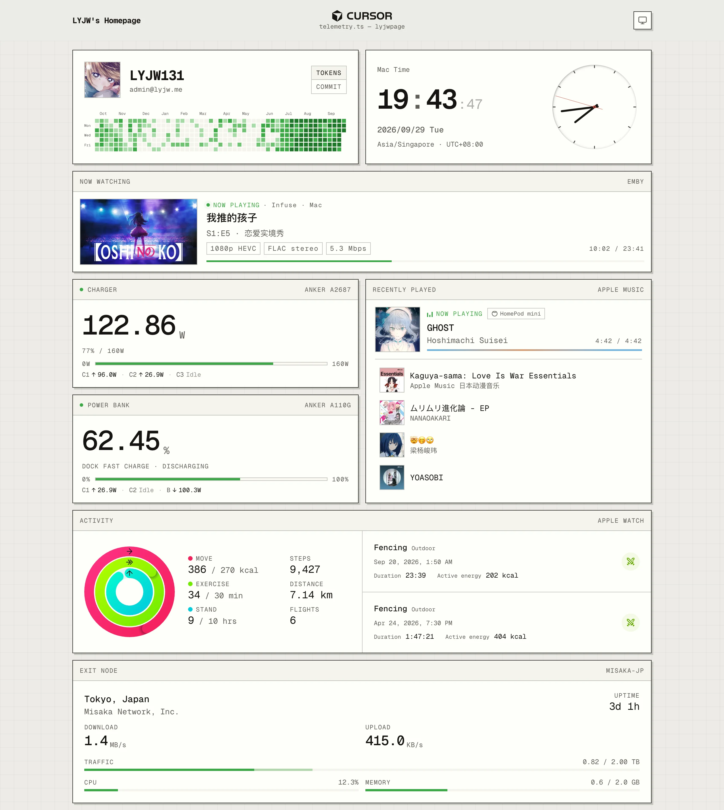
</picture>

**页头的前台应用**：页头中央显示 Mac 此刻的前台应用，图标和名字由 Mac 上报器上报。几款常用工具换成了品牌标识：Claude Code 是像素吉祥物的取物动画，来自 [mascot-fetch-loop](https://github.com/LYJW131/mascot-fetch-loop)（从屏幕录像逐帧复原的 19 个姿势，站点内联其精灵数据自行播放，[在线预览](https://lyjw131.github.io/mascot-fetch-loop/)）；Ghostty 是[官网首页](https://ghostty.org/)那只 ASCII 幽灵，`scripts/ghostty-frames.mjs` 从首页载荷里取出字符画帧，按字形墨量把单元分成本体和光环各几档，抽帧压成粗网格（`src/lib/ghostty-frames.json`，参数见 `scripts/ghostty-frames.mjs#CROP` 等常量），站内用 SVG 路径循环播放，本体跟随页面文字色、光环保持官网的蓝；Cursor 与 Antigravity 用 [LobeHub 图标集](https://github.com/lobehub/lobe-icons)的字标。

<picture>
  <source media="(prefers-color-scheme: dark)" srcset="docs/screenshots/desktop-marks-dark.gif">
  
</picture>

应用名下面那行淡色小字是当前窗口的标题，Cursor 和 Antigravity 两段演示了它出现、变化和消失的样子——但只有通过隐私判断的标题才会出现，见下文。

**Emby 正在播放**：海报、剧集、进度，以及画面、音轨与码率规格。

<picture>
  <source media="(prefers-color-scheme: dark)" srcset="docs/screenshots/now-watching-dark.webp">
  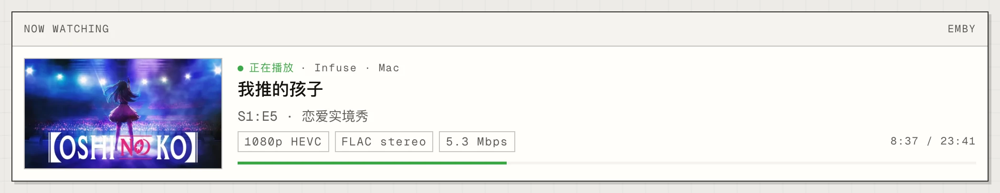
</picture>

**充电设备**：Anker 充电头各端口的功率、设备与协议，以及总功率曲线；充电宝的电量、收放电、温度与健康度。

<table>
  <tr>
    <td width="50%">
      <picture>
        <source media="(prefers-color-scheme: dark)" srcset="docs/screenshots/charger-dark.gif">
        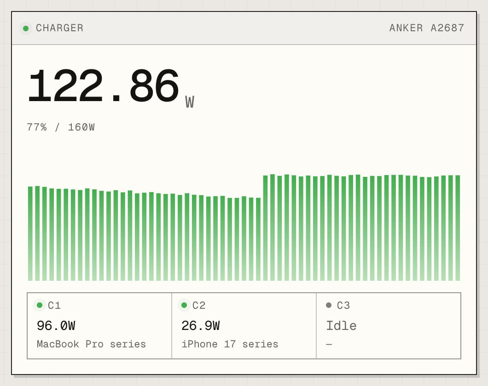
      </picture>
    </td>
    <td width="50%">
      <picture>
        <source media="(prefers-color-scheme: dark)" srcset="docs/screenshots/powerbank-dark.webp">
        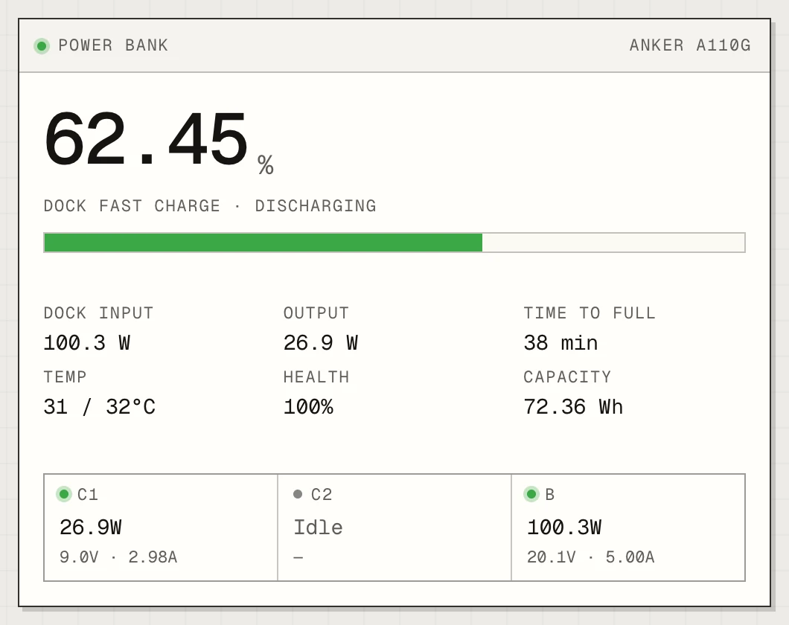
      </picture>
    </td>
  </tr>
</table>

**Apple Music 正在播放**：封面、来源设备、进度与逐字高亮的同步歌词，下方是最近收听。

<picture>
  <source media="(prefers-color-scheme: dark)" srcset="docs/screenshots/now-listening-dark.gif">
  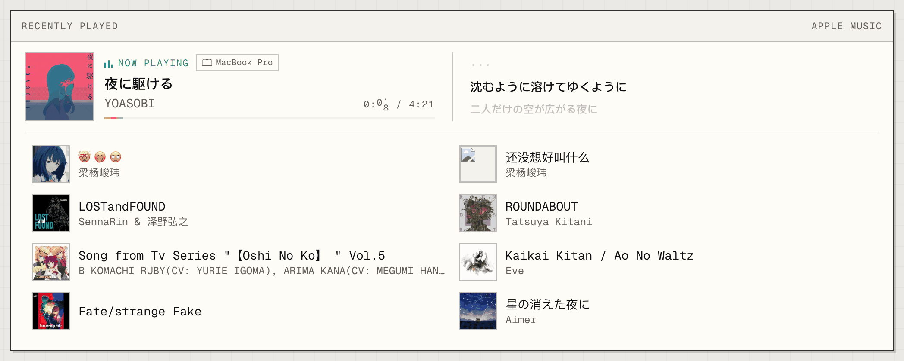
</picture>

**活动与训练**：Apple Watch 的活动、锻炼、站立三环与步数、距离、爬楼，右侧是最近训练，横向翻页。

<picture>
  <source media="(prefers-color-scheme: dark)" srcset="docs/screenshots/activity-dark.gif">
  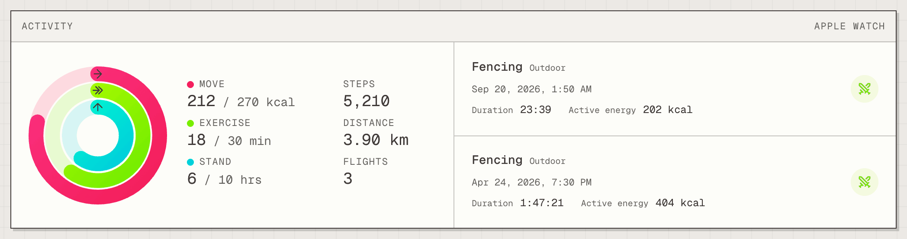
</picture>

**落地节点**：位置与运营商、上下行速率、本计费周期已用流量，以及 CPU 与内存。

<picture>
  <source media="(prefers-color-scheme: dark)" srcset="docs/screenshots/server-dark.gif">
  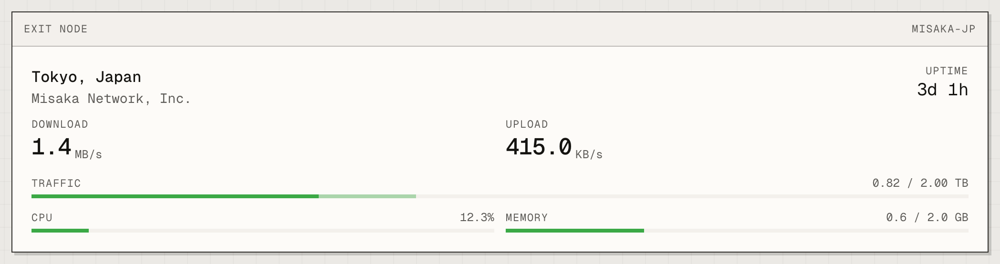
</picture>

**AI Coding**：各编码工具的 Token 用量、成本估算、今日用量与账号限额窗口。用量有三处来源：Mac 本机日志、Cursor 账号侧的历史、Claude Code 云端的遥测，来源只报原始事实，合计、排名、今日和年度格子在状态核心一处算（同一 agent 有账号级历史时只算它，否则相加）。哪个 agent 此刻在用看它最近一次用量事件，Mac 合盖时云端和 Cursor 的灯照样亮；某个来源采集失败时，读数旁标出 Partial，不把缺的那部分当成 0。

<picture>
  <source media="(prefers-color-scheme: dark)" srcset="docs/screenshots/vibecoding-dark.gif">
  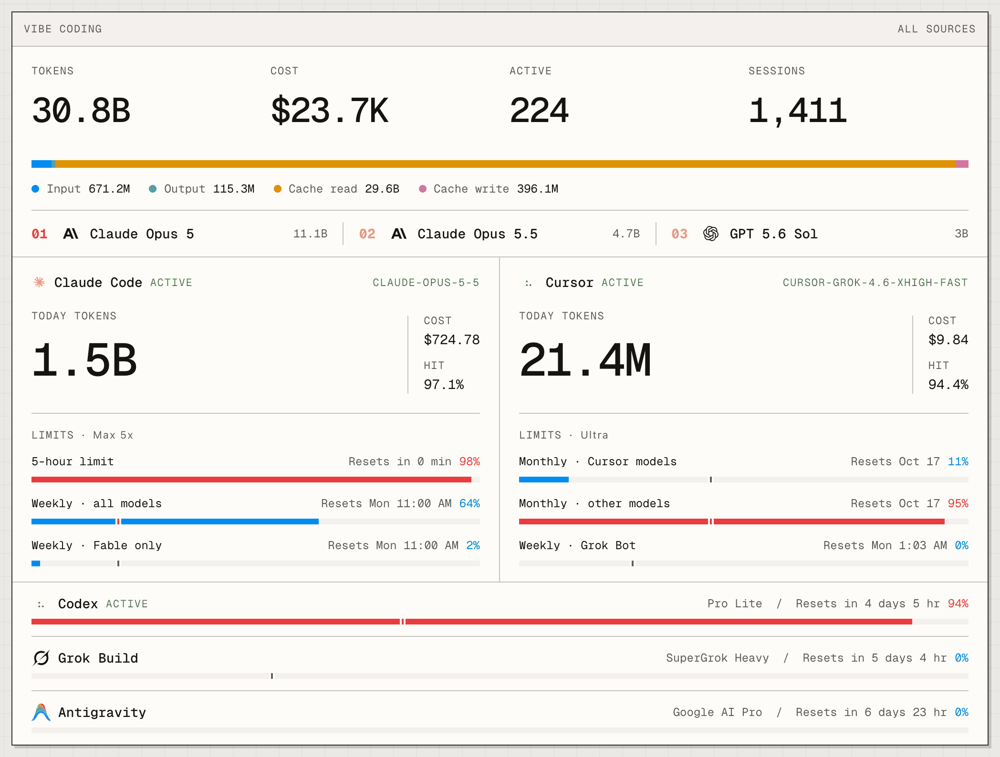
</picture>

**PlayStation**：在线状态、正在游玩的游戏、奖杯统计与最近解锁；展开游戏卡片查看奖杯组与逐条成就。

<picture>
  <source media="(prefers-color-scheme: dark)" srcset="docs/screenshots/playstation-trophies-dark.webp">
  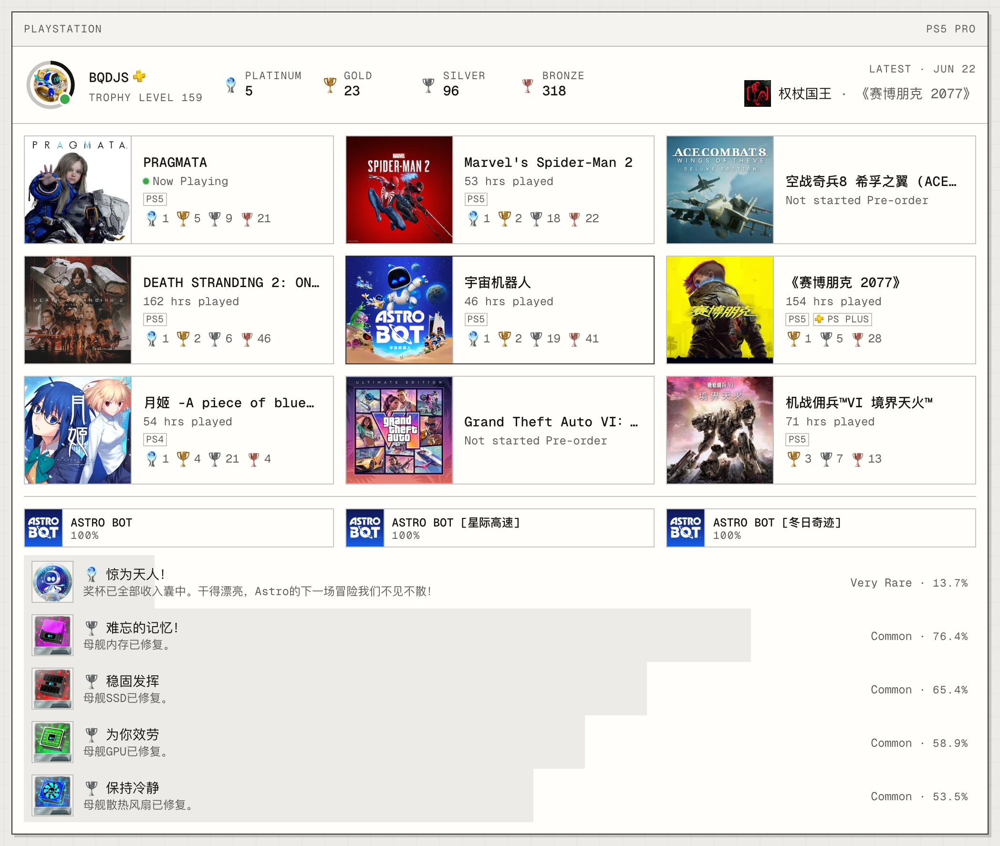
</picture>

**Pulse**：最近 24 小时「在做什么」的事实时间线。编码是三色带：前台开着编码应用、只有 agent 在跑、两者同时，下面的 Tokens 道画按 agent 合并后的每分钟新 token（不含 cache read；同一 agent 有账号级来源就只用它，否则本机与云端相加）；听、看、玩按状态画出在放 / 暂停 / 空闲（在游戏里 / 在线 / 离线），并带上当时的曲目、影视或游戏名；充电画实测瓦数；身体活动画 HealthKit 闭合五分钟桶的步数，训练叠成带项目名的区间。没有观测的时段留空，和观测到的空闲分开。没有上报器的 Apple Music 播放（iPhone、iPad、网页版等），从「最近播放的歌」列表推出来：一首歌开播几秒后就排到列表最前，结合每首时长把连续播放的一串对齐，画成每首一段的斜线区间，悬停可看开播时刻的理想误差。右侧是这一天的事实摘要（编码时长与其中 agent 的时长、在放时长与曲目数、Token 速率峰值与当前速率、充电峰值与电量、步数）。只存原始值，档位与颜色在展示时现算；Jev 只给编码的十五分钟窗口打强度与模式，出现在悬停里。事实每 5 分钟归档到 D1。悬停、点击或用方向键走到某一段，会显示这一段的时间范围和当时的状态与标题。

<picture>
  <source media="(prefers-color-scheme: dark)" srcset="docs/screenshots/pulse-detail-dark.webp">
  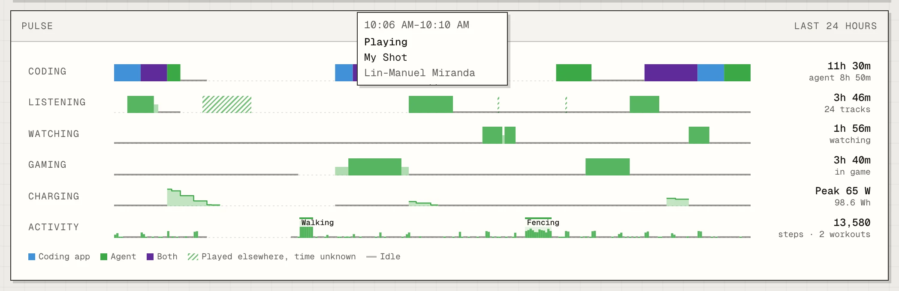
</picture>

**站点自身（LYJWPAGE）**：仓库统计、贡献者与最近提交；下面是状态页式的两行在线状态——`lyjw.me` 看 Sentry 的在线探测，`API` 看 api Worker cron 的心跳，各带 30 天每天一格和可用率；再往下是 PageSpeed 实验室分与真实访客的 Users 分，以及各服务 12 小时的请求、CPU、报错数，落地节点上两个常驻上报器的推送次数、往返延迟与线上版本。

<picture>
  <source media="(prefers-color-scheme: dark)" srcset="docs/screenshots/site-status-dark.webp">
  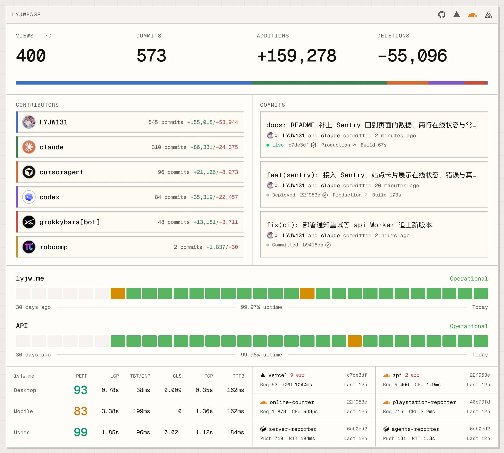
</picture>

## 系统架构

系统分为三部分：**采集端适配不同来源，Cloudflare 统一管理状态，Next.js 负责页面呈现。**

<picture>
  <source media="(prefers-color-scheme: dark)" srcset="docs/architecture-dark.png">
  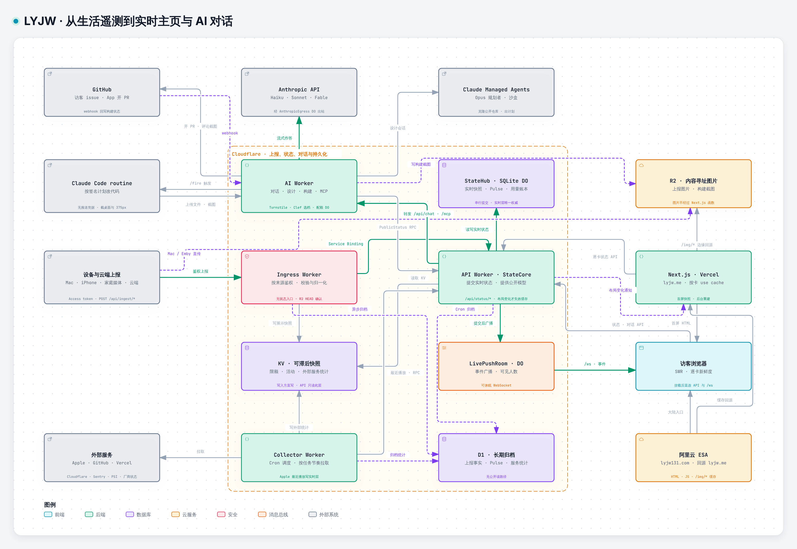
</picture>

[打开交互式架构图](https://lyjw131.github.io/lyjwpage/)

**采集端**运行在数据产生的位置。Mac 采集本机应用、音乐、BLE 设备与编码用量，iPhone 读取运动活动，NAS 代理 Emby 播放状态，Linux 上报器提供服务器指标、Agent 限额与 Cursor 用量，Claude Code 云端环境用内置遥测直接上报。Home Assistant 接入 HomePod 等家庭设备；PlayStation 由家里的容器按局域网里的主机状态拉取，Apple Music 最近在听以及 GitHub、Vercel、Cloudflare、Sentry、PageSpeed 这些外部数据由采集 Worker 定时拉取。

**状态中枢**由 Cloudflare Workers 承担，负责接收上报、整合外部服务数据、提供公开状态 API 和实时推送。上报先到无状态的上报入口 Worker：它在 Cloudflare Access 之后验明每个上报器的身份，校验、收敛报文，再按数据层拆开——实时那一半经 Service Binding 交给持有 Durable Objects 的状态核心（api Worker），可滞后层、归档与凭据自己写。改校验只重新发布上报入口，状态核心不重启、页面的推送连接不断。Durable Objects SQLite 保存实时层的快照与历史，是唯一权威；只展示、可以晚几分钟的数据（外部服务的统计、落地节点、限额等）由写入方直接写进 KV 可滞后层，每条带更新时刻，过没过时由浏览器按各卡阈值判断。R2 保存海报等图片资源，D1 归档训练、圆环、限额、服务器小时汇总、coding 用量与 Pulse 的事实时间线；在线访客由推送那条 WebSocket 顺带计数。

**展示端**运行在 Vercel。Next.js 生成首页时按卡读取 Worker 的各状态端点，浏览器挂载后直接连接 Worker 获取最新状态，不再经由 Vercel 转发状态请求。中国大陆访问入口通过阿里云 ESA 加速页面与静态资源。

## 几个关键设计

### 首屏快照与实时更新分开处理

首页生成时按卡并行读取各模块的端点，每张卡一条 Next.js `use cache` 缓存，让首次展示不依赖浏览器逐张卡片请求数据。实时卡读状态核心，可滞后卡读 KV，任何一张都不在请求路径上现拉外部 API，一张慢卡拖不住整个首屏。

页面加载后，实时卡各自回源校验一次、之后由推送与轮询更新；可滞后卡直接用首屏那份，之后在写入方的下一次预期写入之后几秒去取（节奏登记在 `src/lib/status-views.ts` 的 `cadenceMs`，排期见 `src/lib/poll-schedule.ts`）。首页缓存只在布局变化时（卡片出现或消失、换形态、行数变化，判据见 `src/lib/home-layout.ts`）触发标签失效并在后台重建；读数、标题、进度这类内容变化交给首屏缓存（`src/lib/first-screen.ts` 的 `cacheLife`）的定时重建，纯心跳不触发重建。

因此，缓存页面负责首次展示，客户端负责追上当前状态；不要求每次设备变化都同步刷新整页 HTML。

### 推送、轮询与本地推算各有分工

切歌、前台应用切换、设备插拔等事件通过 WebSocket 推送。多数事件直接携带新数据并写入 SWR 缓存，避免每个访客收到通知后再发起一次相同查询。

功率曲线、累计用量等连续指标按需轮询，播放进度则根据时间锚点在浏览器本地推算。推送连接正常时，推送覆盖整份的实时卡只保留兜底轮询（`src/lib/poll-schedule.ts` 的 `PUSH_SAFETY_NET_MS`），断开时回到卡片自己的快间隔，重连后回源一次带推送事件的视图（页面在后台时等回到前台再取）；客户端的新鲜度检查防止较旧的轮询结果覆盖已收到的新状态。

### 不同来源共享状态与故障边界

设备协议和第三方接口由各自的采集器适配，页面消费统一的公开状态模型，不直接依赖家庭内网服务。

状态读改写在 Durable Object 内串行合并并持久化。单个数据源不可用时，通过统一的状态响应让对应卡片降级，而不是让整页等待所有设备在线。

上报写入需要鉴权，公开查询只返回明确的展示模型，服务端凭据与公开状态分开处理。

### 站点与 Worker 分头部署，旧页面遇到新数据只降级一张卡

Worker 和站点各自部署，浏览器里又可能放着几小时甚至几天前的旧标签页：旧脚本会读到新形状的数据。每张卡外面各有一层错误边界（`src/components/card-boundary.tsx`，用 Next 的 `catchError`），一张卡渲染抛错只有那一格退成 Unavailable，并带着卡片名报 Sentry（同一张卡同样的错一轮只报一次），别的卡和整页照常。兜底卡片上有 Retry，页面没过期时还会自动重试几次（间隔见 `src/lib/card-recovery.ts` 的 `RECOVERY_DELAYS_MS`，页面在后台就等回到前台）；重试前先主动取一份此刻的数据写进这张卡读的 SWR 缓存（取不到的键退回清掉缓存），否则重新挂载会拿着让它崩的那份数据（连首屏那份也算）在渲染阶段再抛一次，连回源都跑不到。取数途中这个键若被推送或同键别的卡的轮询写进了更新的值（按 `src/lib/status-reads.ts` 的 `writeGeneration` 判，没有时间戳的键也一样），或者这张卡已经卸载，这一份就不再写，慢回来的响应盖不掉更新的值。页面已经知道自己旧了（`/api/version`，以及新版本部署完成后的 `version` 推送）时，躺在后台的旧标签页会自己刷新成新版；前台只提示（顶部的版本提示卡，兜底卡片上的说明），不自动刷，免得一张卡出错就打断人在别处的操作，只有整页被错误页顶替时才前台刷新。每个目标版本一轮最多试 `AUTO_RELOAD_MAX_TRIES` 次，账按目标分别记而不是只记最后一个（`lyjw131.com` 的首页 HTML 由 ESA 缓存，刷回来可能还是旧的，版本接口在两个版本间来回也刷不成环）；试满的目标要等 `AUTO_RELOAD_RETRY_AFTER_MS` 才清零重来，边缘缓存恢复后还能刷到它；同一个标签页两次自动刷新至少隔 `AUTO_RELOAD_COOLDOWN_MS`（以上常量都在 `src/lib/app-version.ts`，系统时钟被拨回过时冷却从现在重新数），播放器在放音乐时不刷。判定逻辑见 `src/lib/app-version.ts` 的 `autoReloadDecision`。

### 窗口标题在上报之前先过一道判断

窗口标题是页面上唯一一项窗口内容，也是唯一一项不能靠规则穷举的内容：应用名就那么多个，标题却是此刻打开的文件、网页或聊天对象。所以它在离开 Mac 之前先过一道隐私判断，由 [TypeSafe](https://www.typesafe.ai/) 的 Jev 参与判断能不能公开，拿不准的留给本人在 Mac 上决定；只有放行的标题才进上报信封。站点这一侧不参与判断，只认信封里有没有标题。

### 根据活动与访问情况调整开销

部分采集器根据设备活动和访客连接情况调整上报频率；浏览器标签页不可见时暂停状态轮询。WebSocket 使用 Hibernation API，让连接在没有业务事件时保持而无需实例持续运行。

实时推送连接与可见访客计数分别维护：前者关注状态同步，后者关注此刻正在查看页面的人数。

### 图片按内容寻址，交付域由访客域名的边缘决定

海报和应用图标由上报器一次压好、以 `<sha256>.<ext>` 直传 R2，状态里只存对象键。Worker 和站点把对象键拼成同源路径 `/img/<对象键>`，页面、状态 API 和推送里都不出现交付域。

`lyjw.me` 上由 `next.config.ts` 的 rewrite 把 `/img/*` 代理到 R2 公开源（`R2_PUBLIC_BASE_URL`，只配在 Vercel）：Vercel 边缘转发并按 R2 的 `immutable` 头缓存，不进 Function。`lyjw131.com` 上由 ESA 按静态后缀缓存同一路径并回源，中国大陆访客不再直连 Cloudflare。对象带一年不可变缓存，地址即内容指纹，所以两层边缘都不需要主动刷新。

### 报错与性能交给 Sentry

站点（浏览器与 Vercel 函数）、`api` Worker（请求、API 定时任务、两个 Durable Object）和采集 Worker（各定时任务，失败上报 Sentry；逐任务 cron 报到由 `SENTRY_CRON_CHECKINS` 控制，见 [`workers/collector/README.md`](./workers/collector/README.md)）各报到一个 Sentry 项目；上报入口与 AI Worker 和 `api` 同报一个项目，事件分别带 `worker:ingress`、`worker:ai` 标签。浏览器端经同源的 `/relay` 转发，广告拦截和直连不上 sentry.io 的访客也报得上来；Session Replay 单独成块、页面空闲后才加载，只保留出错那一段。API 定时任务定时报心跳（周期见 `workers/api/src/cron-heartbeat.ts#CRON_SCHEDULE`），`lyjw.me` 有在线探测。采样按免费额度设，入口见 [`src/lib/sentry.ts`](./src/lib/sentry.ts)、[`workers/api/src/sentry.ts`](./workers/api/src/sentry.ts)、[`workers/ingress/src/sentry.ts`](./workers/ingress/src/sentry.ts)、[`workers/ai/src/sentry.ts`](./workers/ai/src/sentry.ts) 与 [`workers/collector/src/sentry.ts`](./workers/collector/src/sentry.ts)；本地默认不上报，要试就在 `.env.local` 设 `NEXT_PUBLIC_SENTRY_DEV=true`。

Sentry 里的数据也回到页面上：采集 Worker 用只读令牌定时取回站点与后端（api、采集两个 Worker 项目合计）的报错数、真实访客的 Web Vitals、在线探测与 cron 心跳，写进可滞后层给站点卡片（`/api/status/sentry`）。在线状态分两行：`lyjw.me` 那行探测的是 Vercel 上的静态路由，只说明前端还在出页面；`API` 那行看 api Worker 的 cron 心跳，每一轮都要经过 Worker 和 Durable Object，补上后端那一截。排查线上报错时 agent 先经 Sentry MCP 查证据再读代码，规矩写在 [`AGENTS.md`](./AGENTS.md)。

## 技术组成

| 层次 | 主要技术 |
| --- | --- |
| 页面与类型 | Next.js 16 App Router · React 19 · TypeScript |
| 样式与交互 | Tailwind CSS 4 · Motion · Number Flow · Geist |
| 客户端数据 | SWR · WebSocket |
| 状态与资源存储 | Cloudflare Workers · Durable Objects SQLite · KV · D1 · R2 |
| 活跃度评分 | Workers AI（Clef） |
| 首页对话 | Anthropic Claude（Clef 选档）、Cloudflare Turnstile |
| 原生设备接入 | Swift / SwiftUI · HealthKit · BLE |
| 页面托管与分发 | Vercel · 阿里云 ESA |
| 报错与性能监控 | Sentry |

AI 对话、MCP 和 GitHub issue 工具由 [`workers/ai`](./workers/ai/README.md) 执行；公开地址经 api 转发，状态数据仍经 api 的只读接口读取。Pulse Coding 评分仍由 api 编排。

## 从哪里读源码

| 想了解什么 | 阅读入口 |
| --- | --- |
| 首页如何组合各个模块 | [`src/app/page.tsx`](./src/app/page.tsx) · [`src/components/live/`](./src/components/live/) |
| 首屏如何按卡读取和缓存状态 | [`src/lib/first-screen.ts`](./src/lib/first-screen.ts) |
| 状态视图在两侧如何登记 | [`src/lib/status-views.ts`](./src/lib/status-views.ts) · [`src/lib/status-loaders.ts`](./src/lib/status-loaders.ts) |
| 推送与轮询如何更新同一份客户端状态 | [`src/hooks/use-live-events.ts`](./src/hooks/use-live-events.ts) · [`src/hooks/use-status.ts`](./src/hooks/use-status.ts) · [`src/lib/status-reads.ts`](./src/lib/status-reads.ts) |
| 网页播放器与歌词如何工作 | [`src/hooks/use-web-player.ts`](./src/hooks/use-web-player.ts) · [`src/hooks/use-lyrics.ts`](./src/hooks/use-lyrics.ts) |
| 上报如何鉴权、校验与按数据层拆分 | [`workers/ingress/`](./workers/ingress/) |
| 状态存储、实时推送与公开 API 如何组织 | [`workers/api/`](./workers/api/) |
| 首页对话、MCP 与模型工具如何运行 | [`workers/ai/`](./workers/ai/) |
| 各类设备与服务如何接入 | [`reporters/`](./reporters/) · [`workers/collector/`](./workers/collector/) |
| 原生 iOS App 如何读站点、如何上报 | [`apps/ios/`](./apps/ios/) |
| 在线访客如何统计 | [`workers/api/src/live-census.ts`](./workers/api/src/live-census.ts) · [`src/hooks/use-live-events.ts`](./src/hooks/use-live-events.ts) |

Mac 端采集器 [MacTelemetryHub](https://github.com/LYJW131/MacTelemetryHub) 独立维护，通过 Git submodule 接入 `reporters/mac-telemetry-hub/`。

本地开发时 `pnpm dev:worker` 用一个 `wrangler dev` 进程起本地 Worker 栈：`workers/dev-router`（拿 8788 端口、按路径分发）、`api`、`ai`、上报入口 `ingress` 和采集 Worker `collector`，状态保存在本地；AI 经只读 Service Binding 查询 api，上报打 `/api/ingest/<来源>` 走上报入口；`/__dev/collector/run?job=<任务>` 立刻跑一个采集任务，`/cdn-cgi/local/scheduled` 让采集 Worker 跑这一分钟到期的任务。步骤见 [`workers/api/README.md`](./workers/api/README.md) 的「本地开发」与 [`workers/collector/README.md`](./workers/collector/README.md)。

## 进一步了解

[遥测与实时状态子系统](./docs/telemetry-subsystems.md) 记录各数据源的接入方式、通信协议与具体实现。

[Worker 数据后端与首屏缓存](./docs/state-storage.md) 说明状态持久化、实时层与可滞后层的划分、公开数据边界、缓存失效与页面更新之间的关系。

[lyjwpage iOS App](./apps/ios/README.md)（iOS 27 原生 SwiftUI）是站点的原生客户端：读同一套公开状态 API 与推送，把首页各卡、Pulse 时间线和最近记录用原生界面呈现，带桌面与锁屏小组件；它同时是 iPhone 端上报器，上报活动圆环与最近的训练，协议和部署顺序见其 README 与 [API Worker](./workers/api/README.md#最近训练)。

Quest 游戏实时数据由 [Discord Gateway 上报器](./reporters/discord-reporter/README.md) 采集，经专用 Access 权限交入 Ingress 与 StateHub；查询 `/api/status/quest/now`，变化推送 `quest-now`；在玩时首页出现 Now Playing 卡，玩过的时段画进 Pulse 的游戏道。协议见 [API Worker](./workers/api/README.md#quest-实时游戏状态)。
